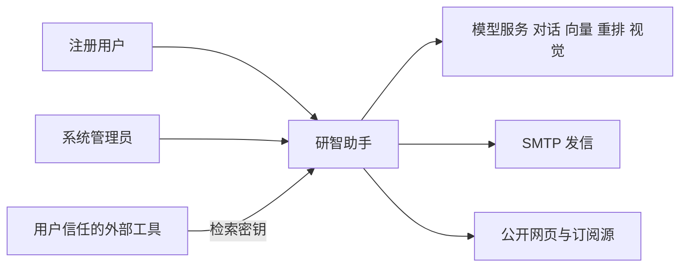
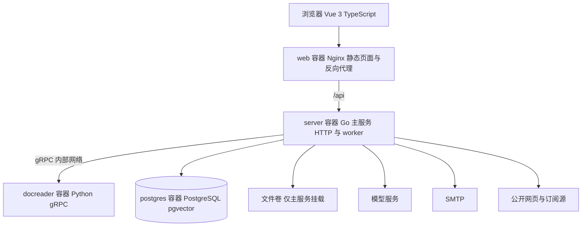
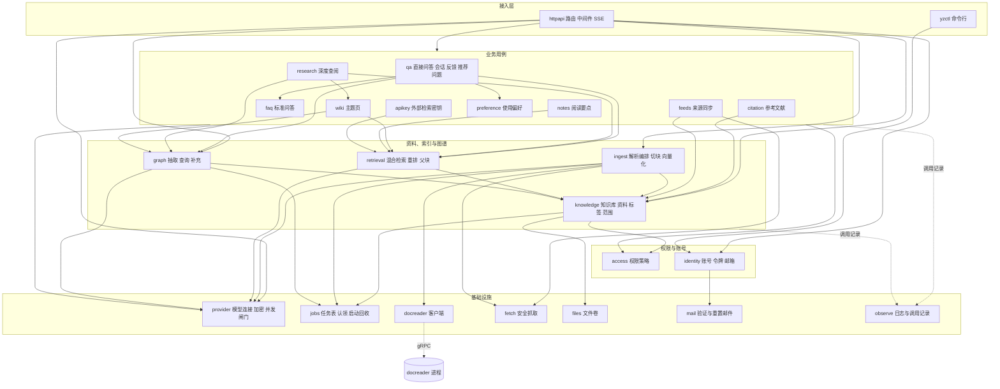
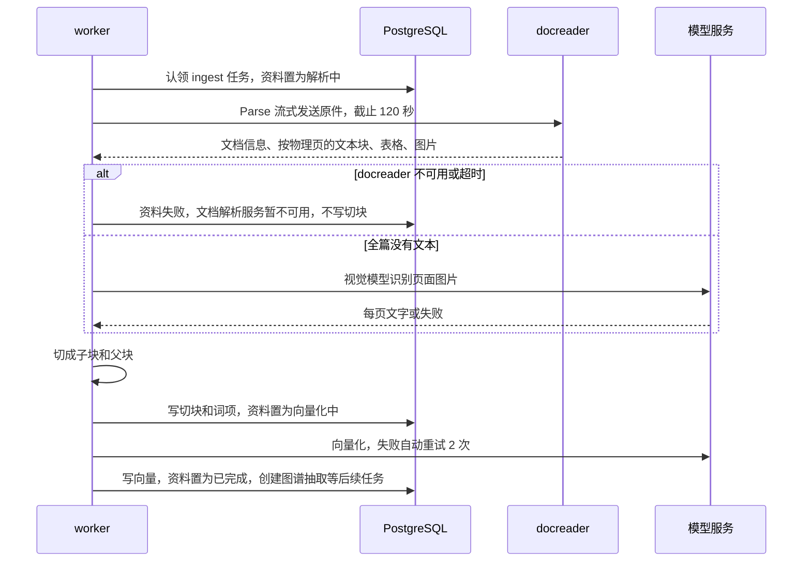

# 研智助手 架构说明

| 项目 | 内容 |
| --- | --- |
| 文档版本 | v0.2（草稿） |
| 日期 | 2026-10-04 |
| 需求基线 | [requirements.md](../requirements/requirements.md) 1.0 |
| AI 使用声明 | 架构文档若使用 AI 起草，采纳和拒绝记在 [architecture-review.md](architecture-review.md)。不在本表预填对话。 |
| 关联文档 | [api-design.md](api-design.md)、[data-design.md](data-design.md)、[module-design.md](module-design.md)、[ADR-001.md](ADR-001.md)、[architecture-review.md](architecture-review.md) |

修订记录：

| 版本 | 日期 | 说明 |
| --- | --- | --- |
| v0.1 | 2026-10-04 | 按旧版需求起草：FastAPI 模块化单体加 Worker，含导师、项目任务和 Related Work。随后只把需求编号换成 1.0，设计未改 |
| v0.2 | 2026-10-04 | 按需求 1.0 重做设计：Go 主服务加 Python docreader，经 gRPC 通信；角色只剩注册用户和系统管理员；新增多知识库、图谱、父子块与预生成问法、知识库回答设置、深度查阅、可编辑 Wiki、录音转写和来源同步；删去导师、绑定、项目任务、提醒、Related Work 和对话分叉；按 1.0 的优先级重排切片 |

## 1 目的与范围

本文说明研智助手首期的软件结构：进程如何划分、请求和后台任务如何跑、质量属性靠什么机制保住。接口字段见 api-design.md，表和索引见 data-design.md，模块职责见 module-design.md。已经拍板的结构选择见 ADR-001.md。

本设计覆盖 FR-01 至 FR-28 和 NFR-01 至 NFR-12 的落点。必须（FR-01 至 FR-08）进入第一可运行切片。应该（FR-09 至 FR-24）有模块和表，排在必须之后。可以（FR-25 至 FR-28）只留模块入口和表，不进入第一切片的完成定义。

OQ-01 至 OQ-11 维持待定。实现按 requirements.md 第 8 节的假设 A-01 至 A-11 编码，并把会变的部分放进配置或单独端口。本文不把这些开放问题改成已决定。

## 2 架构驱动力

| 来源 | 对结构的要求 |
| --- | --- |
| C-01 | 三个进程：Vue 3 + TypeScript 前端由 Nginx 提供，`/api` 转发到 Go 主服务；Python docreader 只经 gRPC 把文件和网页转成文本或页面图片，不连业务库，不生成向量，不回答问题，不抽取图谱 |
| C-02 | 业务数据、向量和图谱都在 PostgreSQL，不另部署图数据库。处理任务记在库中，由主服务的 worker 领取 |
| C-03 | 对话、向量、重排、视觉都走可配置的 HTTP 接口，调用次数要可控 |
| C-04 | Web 应用加 Docker Compose，不做多活集群 |
| NFR-12 | 一条命令启动前端、主服务、docreader 和 PostgreSQL |
| NFR-05、AC 判定顺序 | 未登录 401，角色不能用该功能 403，对具体资源没有读取权限 404。个人资源只有创建者能访问，管理员也是 404 |
| NFR-06 | bcrypt、2 小时令牌、AES-GCM 加密模型密钥、docreader 不对浏览器开放 |
| AC-08-02 | 检索在 SQL 里按当前用户的资料限定，不在应用层事后过滤；图谱补充同样不越界 |
| AC-03-06、AC-07-06 | 主服务重启后，停在解析中、向量化中、抽取中的任务标为失败，不自动重跑 |
| AC-03-08 | docreader 不可用或单次超过 120 秒，资料失败，不生成切块 |
| AC-06-12 | 关键词命中不能被向量低分单独否决 |
| NFR-10、AC-06-06 | 出处必须对得上本次交给模型的切块，图谱补充的切块也算在内 |
| A-06 | 删除资料是硬删除 |

这些条件决定了 ADR-001：Go 主服务内部按模块组织，Python docreader 作为唯一拆出去的解析进程；业务数据、向量、图谱和任务状态放在同一个 PostgreSQL。

## 3 上下文



系统外有两类人和一类外部工具。注册用户管理自己的知识库；系统管理员只配置模型连接、查看运行日志，不阅读资料。外部工具只能用 FR-26 的检索密钥检索密钥主人的已完成资料。

模型服务负责对话、向量、可选的重排，以及视觉能力（扫描页识别和图片描述）。发信只服务 FR-24 的验证邮件和重置邮件。外网访问只发生在三处：用户在一次提问中打开 FR-15 的公开网页检索、FR-21 提交网页地址、FR-27 的来源同步。三处都不登录需要账号的网站。

## 4 容器



| 容器 | 职责 | 不负责 |
| --- | --- | --- |
| 浏览器 | 简体中文界面、表单校验、状态轮询、SSE 展示 | 权限的最终判定 |
| web（Nginx） | 托管前端构建结果，把 `/api/` 转到主服务 | 不把文件卷映射成 URL，不转发到 docreader |
| server（Go 主服务） | 账号、权限、知识库、处理任务、切块、向量、检索、问答、图谱、深度查阅、Wiki、模型调用、日志。后台 worker 在同一进程内领取任务 | 不解析文件格式，不执行上传文件或网页里的脚本 |
| docreader（Python） | 把 PDF、Office、epub、网页、Markdown、文本、图片和录音转成按页组织的文本、表格、图片和页面图片；录音转成文字 | 不连接业务数据库，不生成向量，不回答问题，不抽取图谱，不调用模型服务，不对浏览器开放 |
| PostgreSQL | 业务表、切块、向量、关键词倒排、图谱表、任务表 | 不存明文模型密钥、密码、提示词正文 |
| 文件卷 | 原始文件和手工录入文本的副本 | 不提供未鉴权的静态访问，docreader 不挂载 |

Compose 服务为 `web`、`server`、`docreader`、`postgres`。docreader 不发布端口，只加入内部网络；主服务调用时带上来自环境变量的共享口令。开发期可用可选的 Mailhog 接收邮件，不作为必须项的启动条件。

没有独立的向量数据库、图数据库和消息代理。理由见 ADR-001。

## 5 逻辑视图

主服务的 Go 代码按下面的模块边界组织。依赖只能从上到下：上层可以调用下层，下层不引用上层，也不引用 HTTP 处理器。图中按职责分成五组，虚线表示写调用记录这类横切依赖，以及跨进程的 gRPC 调用。



模块说明书见 module-design.md。路由层只做参数校验和状态码映射。docreader 自身的包结构见第 7 节。

## 6 进程视图

主服务是一个 Go 进程，里面有三类协程：HTTP 处理、任务 worker 池、定时器。耗时工作只在 worker 里做：调用 docreader、识别与图片描述、切块、向量化、预生成问法、图谱抽取、推荐问题、Wiki 生成、来源同步。问答的模型生成留在 HTTP 请求的协程里，以便按 SSE 把首字符推回去，满足 NFR-02。深度查阅由请求创建任务行后，在主服务内单独的协程执行，进度写库并经 SSE 推送。

worker 循环：

1. 进程启动时先做回收（见第 16 节），再启动 worker。
2. 每个 worker 用 `SELECT … FOR UPDATE SKIP LOCKED` 从 `jobs` 认领一条本池负责的待处理任务，置为运行中，并在同一事务里改资料或图谱的对外状态。
3. 入库任务：调用 docreader 取回按物理页组织的文本，需要时调用视觉模型，然后切块、写入关键词索引，置为「向量化中」，调用向量模型。成功则「已完成」，随后创建图谱抽取、预生成问法和推荐问题任务。外部模型单次超时 60 秒，自动重试 2 次，指数退避。docreader 单次调用超时 120 秒，不自动重试。仍失败则「失败」并写下原因。
4. 定时器每小时检查一次到期的订阅源（同一来源每天最多一次），每天清理过期的幂等键和失效令牌。

删除处理中的资料时，主服务先写取消标记并提交。worker 在每个阶段边界读取该标记，不再写入切块或向量，然后由删除事务清掉残留。

docreader 是无状态的 gRPC 服务，按配置的线程数并发处理请求。每次调用的临时文件在调用结束时删除。它不保存任何调用之间的状态，因此主服务重启或 docreader 重启都不需要在 docreader 一侧回收。

## 7 开发视图

```text
proto/docreader/v1/docreader.proto   主服务与 docreader 共用的契约
server/                              Go 主服务
  cmd/server/main.go                 HTTP、worker、定时器入口
  cmd/yzctl/main.go                  创建系统管理员、重置用户密码
  internal/httpapi/                  路由、中间件、SSE
  internal/access/                   权限策略
  internal/identity/                 注册、登录、令牌、邮箱验证、密码重置
  internal/knowledge/                知识库、资料书目、判重、配额、标签、范围、回答设置
  internal/ingest/                   入库编排、识别、切块、向量化、问法、切块修订
  internal/retrieval/                混合检索、RRF、重排端口、父块装配
  internal/graph/                    图谱抽取、合并、查询、补充、清理
  internal/qa/                       会话、问答流水线、出处校验、推荐问题、反馈
  internal/faq/                      FAQ 与不应命中的问法
  internal/research/                 深度查阅的动作循环
  internal/wiki/                     主题页生成、编辑、版本
  internal/notes/                    阅读要点
  internal/citation/                 BibTeX 与 GB/T 7714 模板
  internal/feeds/                    来源同步
  internal/apikey/                   外部检索密钥
  internal/preference/               称呼与回答语言
  internal/provider/                 模型配置、AES-GCM、连接测试、并发闸门
  internal/jobs/                     任务表、认领、心跳、启动回收
  internal/observe/                  request_id、JSON 日志、调用记录
  internal/platform/                 docreader 客户端、fetch、files、mail、clock
  migrations/
docreader/                           Python docreader
  docreader/server.py                gRPC 服务入口
  docreader/parser/                  pdf、office、epub、html、text、image、audio
  docreader/transcribe/              录音转写适配器
  tests/
frontend/src/
  views/                             登录、知识库、资料详情、问答、深度查阅、图谱、Wiki、FAQ、设置、管理
  api/                               HTTP 与 SSE 客户端
compose.yaml
```

主服务中权限、任务状态、检索、图谱抽取和引用格式五个包，用 `go test -cover` 测到语句覆盖率不低于 70%。docreader 的 `parser` 包用 pytest 测到行覆盖率不低于 70%。外部模型在测试里替换为端口的假实现。合并主分支前 CI 运行两侧测试和代码检查（`go vet`、golangci-lint、ruff），满足 NFR-09。

## 8 物理视图与部署

单机 Compose。Postgres 使用带 pgvector 的镜像。文件卷只挂到 server 容器。Nginx 只公开 80 端口，数据库、docreader 和文件卷不映射到宿主机的公网端口。

环境变量提供：JWT 签名密钥、模型密钥的 AES-GCM 主密钥、docreader 地址与共享口令、数据库连接串、文件卷路径、切块和父块参数、检索 Top-K、默认相似度阈值、并发和批大小、bcrypt cost、SMTP 连接参数、公开网页检索接口地址。模型的地址、模型名和密钥不写进环境变量，由管理员在 FR-08 的页面写入数据库。

时钟以 UTC 存储 `timestamptz`。业务日界和展示按 Asia/Shanghai，界面上的处理时间和日志时间标明北京时间（C-05）。

## 9 关键场景

### 9.1 上传与解析

PDF 上传接口只接受文件头为 `%PDF` 的文件，其他格式返回 415，提示使用资料导入。主服务用轻量的 PDF 结构检查读取加密标记和页数，不在上传请求里调用 docreader。加密文件在写库前返回 422，提示「文件已加密，无法解析」，不创建资料、不进入队列。能读出页数且超过 300 页返回 422。超过 50 MB 返回 413。配额按 2×1024³ 字节计算，超出返回 422，错误码 `STORAGE_QUOTA_EXCEEDED`。

同一用户、同一 SHA-256：已有记录不是「失败」时返回 409，并给出已有资料的知识库和 ID；已有记录是「失败」时不新建行，把该行改回「待处理」并重新入队。

docx、pptx、xlsx、csv、epub、html、md、txt、常见图片和录音、网页地址和手工录入文本走资料导入接口（FR-21）。文件夹由前端逐个文件提交，并带上相对路径；单个文件超限只拒绝该文件。



解析保留 PDF 物理页码，从 1 开始，不使用期刊印刷页码。部分页没有文本层时跳过并记在资料上，整篇仍可完成，也不重排后续页码。全篇没有文本层时，docreader 交出页面图片，主服务调用已配置的视觉模型识别，按物理页码写回切块。识别未配置、超时或结果为空，资料失败，原因写明识别未成功，不生成空切块。没有密码但文件损坏，原因是文件已损坏。docreader 未启动或单次调用超过 120 秒，原因是「文档解析服务暂不可用」，不生成切块，用户仍可按 3 次上限手动重试。

切块在主服务完成：子块按段落装箱，目标 500～800 字符，重叠 100 字符；父块是包含子块的更大文本，约 2000～3000 字符。参数来自配置。每个子块记录资料 ID、起始物理页码、段落序号和所属父块。

### 9.2 直接问答

检索范围只能是当前用户自己的、状态为「已完成」的、属于当前向量代际的切块，并按用户选的知识库、标签或资料再收紧。

先判断寒暄：只含问候、致谢这类不需要资料的短句时，不检索，不附出处，直接给出简短回应。再匹配 FAQ：命中标准问或相似问法、且不落在不应命中的问法上时，返回 FAQ 答案并标明来自 FAQ，不附页码。

两路召回：

1. 向量路：在 SQL 里按所有者和范围过滤后，用余弦距离取候选。子块向量和它的预生成问法向量都参与，命中问法时回到原切块。默认保留余弦相似度不低于阈值的命中。阈值初值 0.3，表示余弦相似度；选中单个知识库且该库设了阈值时用该库的值。该定义是实现默认值，OQ-08 仍待定。
2. 关键词路：BM25。拉丁字母与数字按含连字符的整词计，保证 `Zephyr-Bench-9` 这类专名可命中。中文按字二元组。预生成问法的词项也计入所属切块。这一路不使用向量阈值。

两路名次用 RRF 融合，常数 k = 60。已配置重排模型时对融合候选重排，再取 Top-K，默认 5。未配置时按 RRF 顺序取 Top-K。

两路都为空，或向量最高分低于阈值且关键词路为空时，不调用生成模型，直接回复「知识库中未找到相关依据」，出处为空。用户在这次提问中打开了公开网页检索时，改为检索公开网页，网页来源与库内出处分列，不写成库内页码。

取定 Top-K 之后做图谱补充：从这些切块作为证据的实体出发，沿一跳关系最多取 3 个额外切块。它们必须属于同一用户、在本次范围内的已完成资料，关系不能处于暂停状态，并标为「图谱补充」，不占 Top-K 名额。然后为命中的子块装配父块文本，供生成时阅读；出处页码仍以子块起始页为准，父块不单独占一条出处。

有候选时才调用对话模型。提示词把切块放在不可信数据区，只给模型看本次候选的短别名。服务端把别名展开成切块；对不上的别名丢掉。模型判断片段不足以支持结论时输出约定的拒答标记。一个有效出处都没有时，持久化的回答改成拒答句，出处为空。出处展示格式为「资料标题, 第 X 页」，X 为子块上保存的起始物理页，标题用书目中的标题。没有物理页码的资料写「第 1 页」。

回答语言跟随问题，判断不了时用简体中文；用户已确认回答语言偏好时按偏好。选中单个知识库且该库设了回答说明时，说明只影响回答方式，不改变出处规则。

流式协议使用 SSE。首字符来自生成过程。出处事件只在校验之后发送。客户端断开则停止继续读取模型流。

多轮会话携带最近 5 轮。追问先走改写端口，失败则用原问题检索，并只在日志里记是否改写。

### 9.3 权限

每次业务请求按这个顺序停在第一次命中：

1. 无令牌、令牌过期、令牌已退出、令牌签发早于该用户的令牌作废时间：401。外部检索密钥只能调用外部检索接口，在其他接口上同样是 401。
2. 角色不能使用这个功能（普通用户调用模型配置、日志和反馈导出），或邮箱未验证却要上传、导入或提问：403。
3. 资源不属于调用者，包括其他注册用户，以及系统管理员访问知识库、资料、切块、笔记、会话、标签、图谱、Wiki、FAQ、深度查阅、偏好：404。404 的响应体不含标题、节点名称或能够区分「不存在」和「无权」的差异。

本期没有协作和只读共享（A-04）。所有者对自己的资源可读可写，因此不再有「能读不能改」的 403。

### 9.4 更换向量模型

管理员保存新的向量模型名或维度时，若库内已有向量，请求必须带确认重建。未确认则配置不变，返回 409。确认后，活动代际加一，旧向量清空，已有资料全部回到「待处理」，图谱证据全部暂停补充。检索条件包含当前代际，因此旧向量不会被命中。

重建任务只重新向量化现有切块，不重新调用 docreader 解析，因此 FR-18 修订过的切块文本不会被原文覆盖。资料再次变为已完成后重新抽取图谱，新证据写入后才恢复补充。维度变化时在同一次确认里重建向量列。

### 9.5 删除资料

所有者确认后硬删除：原始文件、切块、父块、预生成问法、向量、标签关联，并取消在途任务。图谱按 FR-07 清理：删除只以该资料为证据的关系，以及因此不再连接任何关系、且不是仍留在库中的资料所对应的文献节点；其他资料对它的引用边改记为引用方的未入库引用。历史问答里的出处保留标题快照，显示「来源已删除」。

### 9.6 深度查阅

用户对选定范围发起深度查阅后，主服务创建任务行并在协程里运行动作循环。每一步由模型从六类动作中选择一个：检索本人知识库、按资料阅读切块、列出资料、查询本人图谱、检索并阅读本人 Wiki、查看已导入表格的列说明。服务端执行动作时再次按所有者和范围收紧，结果登记进同一张别名表。

步骤按顺序写库并推送给界面。动作步默认最多 8 步，达到上限后追加一步「整理回答」，用已获得的材料作答并说明查阅结束，这一步不再调用任何动作。用户点击停止后，循环取消在途的模型请求，5 秒内不再发起新的模型调用，状态为已停止。某一步自动重试 2 次后仍失败，任务为失败，已完成步骤的结果保留。没有从中间一步续跑的接口，再次查阅是一次新任务。最终回答走同一条出处校验。

### 9.7 图谱抽取

资料变为已完成、且所属知识库启用了图谱时，主服务创建抽取任务，图谱状态为「待抽取」。worker 按批把切块交给对话模型，要求按固定类型输出实体、关系和证据句。服务端只保留类型在白名单内、证据切块属于本批、证据句能在切块文本中找到的关系，没有证据的关系不保存。实体名称去掉首尾空白、合并连续空白、拉丁字母转小写后在同一用户内合并。引用只连接到该用户库内已完成、标题能对应的资料，对不上的题名写入未入库引用。

20 页以内的文本型 PDF，模型服务正常时 3 分钟内结束。抽取失败自动重试 2 次后标失败，资料仍为已完成，问答照常。用户可手动重试，最多 3 次。

### 9.8 Wiki

用户让一个知识库生成 Wiki 时，主服务创建生成任务。任务从该库图谱中证据最多的方法、数据集、指标和研究问题选出主题，按主题检索切块，由模型写出带别名标记的主题页和页间链接。服务端只保留能展开成本库切块的出处和指向本次或已有主题页的链接，没有有效来源的页不保存。生成失败不影响资料状态和直接问答。

所有者保存修改时追加一个版本，旧版本保留并可恢复。深度查阅的 Wiki 动作读取同一批页面的当前版本。

## 10 质量属性策略

| 编号 | 策略 |
| --- | --- |
| NFR-01 | 登录、资料列表、知识库列表只做带所有者条件的索引查询。bcrypt cost 可配置，用压测选定。用 20 并发、5 分钟的压测把关 |
| NFR-02 | 5000 切块规模使用带所有者过滤的精确近邻，加上关键词倒排。图谱补充只走证据表和关系表的索引，计入检索阶段。生成用 SSE，首字符不等待整段结束 |
| NFR-03 | 解析与向量化在 worker 异步执行。图谱抽取、预生成问法和推荐问题在资料完成之后另起任务，不计入 60 秒 |
| NFR-04 | 上传前检查 50 MB、300 页、2 GB。2 GB = 2,147,483,648 字节。配额函数集中在 knowledge，OQ-10 改动只改这里 |
| NFR-05 | 唯一的策略模块执行第 9.3 节的顺序。每个业务接口都有其他用户和管理员访问的测试 |
| NFR-06 | bcrypt 存密码。JWT 有效期 2 小时。模型密钥用 AES-GCM 加密，主密钥来自环境变量。docreader 只在内部网络监听并校验共享口令。原始文件只经鉴权下载 |
| NFR-07 | JSON 日志带 request_id，后台任务继承创建它的请求的 request_id。日志允许模型名、耗时、token 数、状态和提示词的 SHA-256。不允许明文密钥、密码、提示词正文、回答正文和资料全文 |
| NFR-08 | 模型超时 60 秒，自动重试 2 次。docreader 单次超时 120 秒。启动回收把中断的解析和抽取标失败 |
| NFR-09 | 端口可替换。主服务五个关键包语句覆盖率不低于 70%，docreader 解析包行覆盖率不低于 70%，CI 跑两侧测试和代码检查 |
| NFR-10 | 出处校验器是纯函数。评测脚本检查悬空出处为 0，图谱补充的切块算在候选内。每条关系至少一条可打开的证据 |
| NFR-11 | 界面文案简体中文。支持 Chrome 和 Edge 最近两个大版本。知识库、问答和图谱在 1366×768 下可以到达且布局完整。判定的检查点需求尚未列出，本文不发明 |
| NFR-12 | Compose 文件和 README 的步骤覆盖首次启动、创建管理员、打开首页，目标 30 分钟内完成 |

## 11 迭代切片

| 切片 | 内容 | 故事点 | 完成判据 |
| --- | --- | --- | --- |
| 第一切片 必须 | 账号与令牌、资料访问控制、多知识库与 PDF 上传、docreader 解析与索引、删除、标签与范围、直接问答（含寒暄、拒答、关键词专名）、知识图谱（抽取、浏览、一跳补充、清理）、模型连接 | 46（US-01 至 US-09） | FR-01 至 FR-08 的全部验收：AC-01-01 至 AC-09-05，即跟踪矩阵第 1 至 11 行 |
| 第二切片 应该 | 会话、查询改写、重排、父子块与预生成问法、知识库回答设置与推荐问题、深度查阅、公开网页、Wiki、FAQ、切块修订、参考文献、阅读要点、多种资料来源、扫描件表格图片与录音、运行日志、邮箱验证与密码重置 | 64（US-10 至 US-25） | FR-09 至 FR-24 的验收。时间不够时整项后移，不削验收 |
| 第三切片 可以 | 回答反馈、外部检索密钥、来源同步、使用偏好 | 10（US-26 至 US-29） | FR-25 至 FR-28 的验收，不阻塞首期发布 |

第二切片内部建议的顺序：先做问答增强（FR-09、FR-10、FR-11、FR-12、FR-13、FR-17），再做资料扩展与账号（FR-21、FR-22、FR-18、FR-24、FR-23），最后做沉淀与查阅（FR-20、FR-19、FR-16、FR-14、FR-15）。这只是排期建议，不改变需求优先级。

第一切片的数据表仍包含父块、会话和 FAQ 所需的外键位置，避免第二切片改主键。第一切片不实现 FR-24 时，未验证邮箱的限制由配置关闭；FR-24 上线时同时打开。可以级别的表在做该项时再迁移。

## 12 需求到模块

功能需求：

| FR | 名称 | 主要模块 | 故事 | 切片 |
| --- | --- | --- | --- | --- |
| FR-01 | 账户 | identity | US-01 | 必须 |
| FR-02 | 资料访问 | access，各模块的仓库查询 | US-08 | 必须 |
| FR-03 | 知识库与资料 | knowledge、files | US-02、US-04 | 必须 |
| FR-04 | 解析与索引 | ingest、jobs、docreader | US-03、US-04 | 必须 |
| FR-05 | 标签与范围 | knowledge | US-05 | 必须 |
| FR-06 | 直接问答 | qa、retrieval | US-06、US-08 | 必须 |
| FR-07 | 知识图谱 | graph、jobs | US-07 | 必须 |
| FR-08 | 模型连接 | provider | US-09 | 必须 |
| FR-09 | 会话 | qa | US-10 | 应该 |
| FR-10 | 查询改写 | qa | US-11 | 应该 |
| FR-11 | 重排 | retrieval、provider | US-12 | 应该 |
| FR-12 | 切块上下文与问法 | ingest、retrieval | US-13 | 应该 |
| FR-13 | 知识库回答设置与推荐问题 | knowledge、qa | US-14 | 应该 |
| FR-14 | 深度查阅 | research | US-15 | 应该 |
| FR-15 | 公开网页 | qa、fetch | US-16 | 应该 |
| FR-16 | Wiki | wiki | US-17 | 应该 |
| FR-17 | FAQ | faq、qa | US-18 | 应该 |
| FR-18 | 切块修订 | ingest、graph | US-19 | 应该 |
| FR-19 | 参考文献导出 | citation | US-20 | 应该 |
| FR-20 | 阅读要点 | notes | US-21 | 应该 |
| FR-21 | 多种资料来源 | knowledge、ingest、fetch、docreader | US-22 | 应该 |
| FR-22 | 扫描件、表格、图片与录音 | ingest、provider、docreader | US-23 | 应该 |
| FR-23 | 运行日志 | observe | US-24 | 应该 |
| FR-24 | 邮箱与密码重置 | identity、mail | US-25 | 应该 |
| FR-25 | 回答反馈 | qa | US-26 | 可以 |
| FR-26 | 受信任的外部检索 | apikey、retrieval | US-27 | 可以 |
| FR-27 | 来源同步 | feeds、fetch | US-28 | 可以 |
| FR-28 | 使用偏好 | preference、qa | US-29 | 可以 |

质量需求：

| NFR | 主要落点 |
| --- | --- |
| NFR-01 | knowledge、identity 的查询与索引；压测脚本 |
| NFR-02 | retrieval、graph 的补充查询、qa 的 SSE |
| NFR-03 | ingest、jobs、docreader |
| NFR-04 | knowledge 的上传检查与配额函数 |
| NFR-05 | access，各模块仓库查询的所有者条件 |
| NFR-06 | identity、provider、httpapi 中间件、files、Compose 网络 |
| NFR-07 | observe |
| NFR-08 | provider 的超时与重试、platform 的 docreader 客户端、jobs 的启动回收 |
| NFR-09 | CI 配置、两侧测试 |
| NFR-10 | qa 的出处校验器、graph 的证据约束、评测脚本 |
| NFR-11 | 前端 |
| NFR-12 | compose.yaml、README、yzctl |

## 13 仍待定的问题如何不影响骨架

| 开放问题 | 当前编码 | 以后只改哪里 |
| --- | --- | --- |
| OQ-01 | 全站一套模型密钥，由管理员配置 | provider，不把密钥放到用户表 |
| OQ-02 | SHA-256 判重，失败记录重新入队，不识别不同版本 | knowledge 的判重函数 |
| OQ-03 | 全篇无文本时主服务调用视觉模型识别 | ingest 的识别适配器；若改用可部署的文字识别组件，在 provider 增加一种模型类型 |
| OQ-04 | 资源只有创建者 | 不建成员表；若做只读协作，只改 access 和范围解析 |
| OQ-05 | 上传页提示资料会发送到模型服务 | 前端文案，处理路径不变 |
| OQ-06 | 确认后硬删除 | knowledge 的删除用例 |
| OQ-07 | 模板默认 GB/T 7714-2025 | citation 的模板注册 |
| OQ-08 | 配置项：余弦相似度、阈值 0.3、不足则拒答 | retrieval 的配置和 qa 的空结果处理 |
| OQ-09 | 日志无正文 | observe 的字段白名单 |
| OQ-10 | 只限制 2 GB，图谱抽取计入调用记录 | knowledge 的配额函数，provider 的调用计数 |
| OQ-11 | 只用 FR-07 列出的实体和关系类型；引用只连本人库内已完成资料，其余写入未入库引用 | graph 的类型白名单和引用匹配函数 |

## 14 风险

| 风险 | 处理 |
| --- | --- |
| bcrypt cost 与登录 500 ms 预算冲突 | cost 可配置，压测选定 |
| 中文 BM25 与专名要同时成立 | 含连字符的拉丁整词单独成词，中文用字二元组，评测里保留 AC-06-12 |
| 流式输出与出处校验的先后 | 先流式文本，出处事件后发。校验失败时用替换事件改成拒答，库内以拒答为准 |
| 重启语义容易被自动重投破坏 | 任务表由主服务自己认领，不用会在进程崩溃后自动重投的代理 |
| docreader 与主服务的边界测不出来 | 契约只在 proto 里定义；主服务用假 docreader 测超时和不可用；docreader 用样例文件测页码 |
| 图谱抽取 3 分钟预算与调用费用 | 按批抽取，图谱任务有单独的并发池；调用计入调用记录，按 OQ-10 再定上限 |
| 父块让模型读到子块之外的文字 | 出处仍只取子块页码，校验只认子块别名；评测抽查父块带来的错页 |
| 必须共 46 点，含图谱 8 点 | 第一切片不接应该和可以的功能 |
| OQ 翻转 | 第 13 节的改动点保持单模块 |

NFR-11 的「布局完整」和 NFR-10 的人工抽检方法仍然缺少可执行定义。架构不补充未写入需求的抽检协议。

## 15 请求在进程内怎么走

主服务分四层。上层只能调用相邻的下一层。

| 层 | 代码位置 | 做什么 | 不做什么 |
| --- | --- | --- | --- |
| 中间件 | `internal/httpapi/middleware` | request_id、访问日志、恢复 panic、认证、请求体大小 | 不判断某份资料归谁 |
| 处理器 | `internal/httpapi/handlers` | 解析请求、调用用例、映射状态码 | 不写 SQL，不拼提示词 |
| 用例 | 各业务包的 `service.go` | 事务、流水线、调用端口 | 不依赖 `net/http` 的请求对象 |
| 仓库 | 各业务包的 `repo.go` | SQL 和行映射 | 不调用模型 |

组合根是 `internal/app`。它创建数据库连接池、文件卷、时钟、模型端口、docreader 客户端和用例对象，再交给路由和 worker。测试替换组合根里的端口，不在用例内部分支「如果是测试」。

中间件顺序固定：

1. 生成或沿用 `X-Request-Id`，放进 `context.Context`。
2. 记录方法、路径、状态码和耗时。查询串里的口令、请求体里的 `password` 和 `api_key` 替换成 `***`。SSE 正文不写入这条日志。
3. 恢复未处理的 panic，返回 500 的统一错误体，正文不带堆栈。
4. 业务路由再做认证和 `access` 判断。
5. 请求结束时删除本请求落在临时目录里的 multipart 文件，包括处理失败和异常退出。

`/health` 放在认证之前。管理接口和业务接口共用同一条认证中间件，角色差异由 `access` 决定。

可信代理只包括 web 容器。不把任意 `X-Forwarded-For` 当作客户端地址。本期没有按 IP 的限流配额，这条规则是为了日志里的来源地址不被伪造。

## 16 启动、关闭和在途任务

主服务启动顺序：

1. 读环境变量。缺 JWT 密钥、AES-GCM 主密钥、docreader 共享口令或数据库连接串时直接退出。
2. 执行数据库迁移。迁移失败则进程退出，不带着旧表结构接流量。
3. 回收：把运行中的入库和重新向量化任务标失败，对应资料从「解析中」或「向量化中」改为「失败」，原因是「处理中断，请重试」，手动重试次数不变；把运行中的图谱抽取标失败，图谱状态为失败，原因是处理中断，同样不计入 3 次；运行中的 Wiki 生成和深度查阅标失败。没有对外状态的任务（切块重建、预生成问法、推荐问题、来源同步）放回待处理。
4. 启动 worker 和定时器，然后监听端口。

主服务只有一个实例（C-04），回收不需要和另一个进程抢锁；任务认领仍用 `SKIP LOCKED`，保证同一进程里的多个 worker 不会拿到同一行。

收到停止信号时：

1. 停止接受新连接，已在进行的问答最多再等 10 秒。超时则向前端发送 `error`，不把没有通过出处校验的半段文字写成成功回答。
2. worker 不再认领新任务。已经认领的任务若 10 秒内不能走到终态，按第 3 步的规则标失败。
3. 深度查阅取消在途的模型请求，任务标失败。
4. 不把这些任务重新放回队列。

进程还活着但某个任务的心跳停止时，主服务每分钟检查一次。`jobs.heartbeat_at` 早于 2 分钟、且本进程登记的执行句柄已经不在的任务，按同样的失败原因收口，同样不增加手动重试次数。

docreader 重启只会让正在进行的那次 gRPC 调用返回不可用，主服务按「文档解析服务暂不可用」处理。

## 17 资料入库流水线

文件格式解析在 docreader，切块、识别和向量写入在主服务的 worker。两边只通过 proto 里的页块契约交换数据：按物理页分组，每页有若干块，块的种类是标题、段落、表格或图；另外有抽出的图片、页面图片、表格列说明和录音转写。切块器只读这个模型，所以 docreader 换解析库不会改页码规则。

PDF 用文本层抽取，设置了打开密码的文件到不了这里。某一页没有文本就记入 `skipped_pages` 并继续，不强制整篇识别。全部页都没有文本时，docreader 在同一次调用里交出页面图片，主服务调用视觉模型识别。docx、pptx、xlsx、csv、epub、html、md、txt、图片、录音和手工录入文本没有 PDF 物理页，整份的 `page_start` 记为 1，出处仍写「标题, 第 1 页」，详情说明该资料没有 PDF 页码。

一份资料的入库任务阶段：

| 阶段 | 资料对外状态 | 成功之后 | 失败时 |
| --- | --- | --- | --- |
| 认领 | 解析中 | 进入取件 | 保持待处理，下轮再认领 |
| 取件 | 解析中 | 读出原件；网页由主服务安全抓取 | 资料失败，网页原因含网页抓取失败 |
| 解析 | 解析中 | 页块落在本轮内存结果 | 资料失败，不写切块 |
| 识别与描述 | 解析中 | 无文本的整篇写回识别文字；图片得到描述 | 识别失败则资料失败；单张图片描述失败只跳过该图 |
| 切块 | 解析中 | 写入子块、父块和词项，向量仍为空 | 删掉本轮切块和词项，资料失败 |
| 向量化 | 向量化中 | 向量与活动代际一起提交 | 清空本轮向量和切块，资料失败 |
| 收尾 | 已完成 | 任务成功，创建后续任务 | 不会在这一步失败 |

只有收尾提交成功，状态才是「已完成」。在此之前切块对检索不可见，因为检索要求状态为已完成。失败路径先删本轮产物再改状态。重试开始时先按资料 ID 删除旧切块。

收尾之后另起三类任务，失败都不把资料改回失败：图谱抽取（FR-07，知识库启用图谱时）、预生成问法（FR-12，每个子块不超过 3 个，生成失败的切块仍按原文检索）、推荐问题（FR-13）。它们放在入库任务之外，一是不占 NFR-03 的 60 秒，二是费用可以单独限流。不为资料自动打标签，需求没有这条。

表格在切块前转成文本，保留单元格内容；xlsx 和 csv 另存列说明，供深度查阅的表格动作使用。录音由 docreader 转写成文字后按一份资料索引，转写失败只让这份录音失败。

网页地址在提交时检查一次，worker 真正抓取前再检查一次。两次都拒绝内网地址、链路本地地址、带用户信息的 URL，以及重定向之后落到这些地址的目标。最多跟随 3 次重定向。响应体超过 50 MB 则失败。抓到的 HTML 交给 docreader 只提取正文，不执行页面脚本，不保存整站。

进度由 `jobs` 和阶段行提供。列表接口只返回资料五态和图谱状态。详情接口额外返回当前阶段，界面轮询间隔 2 秒，满足 5 秒内看到变化。

## 18 问答流水线

一次提问是一条固定阶段的流水线，不是模型自己决定要不要检索。阶段读同一个 `TurnContext`。这个对象在请求开始时创建，请求结束即丢弃，不写入日志。

| 顺序 | 阶段 | 跳过条件 | 写入上下文的结果 |
| --- | --- | --- | --- |
| 1 | 寒暄判断 | 不是问候、致谢这类短句 | 命中则给简短回应并结束，不检索，不附出处 |
| 2 | 加载最近 5 轮 | 新会话 | `history` |
| 3 | 已确认的偏好 | 没有已确认的称呼或回答语言 | `preferences`。失败则当作没有 |
| 4 | FAQ | 范围内没有 FAQ，分数不够，或落在不应命中的问法上 | 命中则直接结束，标明来自 FAQ |
| 5 | 查询改写 | 只有一轮，或功能关闭 | `query`。失败则保留原问题 |
| 6 | 并行检索 | 改写结果为空不会发生 | 向量候选（含问法命中）、关键词候选 |
| 7 | RRF | 两路都空，或向量低于阈值且关键词为空 | 融合名次；否则进入拒答或外网 |
| 8 | 重排 | 未配置 | 新顺序。调用失败则退回 RRF |
| 9 | 截断 Top-K | | `candidates` |
| 10 | 图谱补充 | 图谱为空、全部暂停或抽取失败 | 最多 3 条 `graph_extra` |
| 11 | 父块装配 | 子块没有父块 | 每个候选的父块文本 |
| 12 | 外网检索 | 用户未打开，或库内已有候选 | 与库内出处分开的外部条目 |
| 13 | 分配别名并流式生成 | 没有候选且没有外部条目 | 文本增量 |
| 14 | 展开别名并落库 | | 回答、出处、偏好提议 |

阶段 6 的两路并发，查询向量只算一次。关键词路不使用余弦阈值。融合之后才截断到 5。图谱补充发生在截断之后，不占名额。不把相邻切块再拼回提示词：上下文由父块提供，出处仍以子块为准。

寒暄判断只用规则：问候、致谢、告别这类固定说法，长度很短，且不含资料相关的实词。命中时用对话模型生成一句简短回应；模型不可用时返回固定的问候句。任何带有内容问题的输入都不走这个分支，避免绕过「没有依据就拒答」。

检索为空且没有打开公开网页时，回复只有「知识库中未找到相关依据」。OQ-08 若以后允许一般知识，只改阶段 7 的空结果处理。

流水线对前端发送 `progress` 事件，取值限于 `rewrite`、`search`、`graph`、`generate`。这些事件不包含切块正文。检索完成后、生成开始前，发送 `retrieval`，列出本次允许引用的别名和标题页码，图谱补充的条目带标记。这个列表是候选，不是回答已经采用的出处。回答采用的出处只来自最后的 `citations` 事件。

用户在问题里明确说出可复用的称呼或回答语言（例如「以后用英文回答」）时，阶段 14 写一条待确认的偏好并发送 `preference_proposal` 事件。确认之前，这条偏好不影响任何会话。

用户停止时，主服务取消模型读取，流水线在下一阶段边界退出。已取消的这轮不写成功回答。若还没有任何 token，不创建轮次。

## 19 引用别名

模型上下文里的切块编号是 `c1`、`c2` 这种短别名，图谱补充的切块是 `g1`，外网来源是 `w1`。别名表只活在这一次 `TurnContext` 里。系统提示要求模型用 `[[c1]]` 引用，禁止写出存储路径、切块 UUID 和提示词本身。父块文字附在对应子块的别名下面，没有自己的别名。

流式解码器要能跨两个 token 拼出半个标记。未知标记删除，不显示给用户。展开时用子块上的 `page_start` 和资料标题生成「标题, 第 X 页」。资料已删除则显示「来源已删除」。

评测读取数据库里的 `qa_citations`。每一行的 `chunk_id` 必须属于该轮保存下来的候选集合或图谱补充集合。别名本身不入库。深度查阅、阅读要点和 Wiki 使用同一个解码器。

## 20 流式缓冲

生成任务和 HTTP 连接分开。主服务进程内按 `turn_id` 保存追加事件，默认保留 15 分钟，只在本进程有效。单实例部署不需要把事件流放到另一个中间件里。

客户端用最后收到的事件序号调用续传接口。服务端从该序号之后重放，若生成仍在进行则继续推送。进程重启后缓冲消失。已经落库的轮次从会话详情读取。没有落库的轮次，续传返回 404，前端提示重试。深度查阅的步骤已经写库，续传直接从库里读，不依赖这个缓冲。

事件序号从 1 递增。`id` 字段放在 SSE 的 `id:` 行，便于浏览器原生重连。反向代理必须关闭对 `/api/v1/qa/` 和 `/api/v1/research-tasks/` 的响应缓冲。

## 21 并发与模型调用

同一进程内用带权信号量限制并发，数值来自环境变量：

| 名称 | 默认 | 保护的调用 |
| --- | --- | --- |
| `INGEST_WORKERS` | 2 | 同时处理的入库任务数，也是同时进行的 docreader 调用数 |
| `GRAPH_WORKERS` | 2 | 同时进行的图谱抽取任务数 |
| `BACKGROUND_WORKERS` | 1 | 预生成问法、推荐问题、Wiki、来源同步 |
| `EMBED_CONCURRENCY` | 2 | 同时进行的向量请求数 |
| `EMBED_BATCH_SIZE` | 16 | 每次向量请求的文本条数 |
| `LLM_CONCURRENCY` | 4 | 问答、改写、抽取、要点、深度查阅、Wiki 的生成请求数 |
| `VISION_CONCURRENCY` | 2 | 识别和图片描述 |

模型调用超时 60 秒，自动重试 2 次，间隔 1 秒和 2 秒。docreader 调用超时 120 秒，不自动重试。测试可以把这些数调小。重试耗尽才把资料、抽取或查阅步骤标失败。手动重试是另一条路径，上限 3 次。

问答请求在 `LLM_CONCURRENCY` 中有保留名额，后台任务不能占满它，避免批量入库后的抽取把首字符时间拖过 5 秒。

## 22 提示词

模板放在 `server/internal/prompts/`，用 `embed` 编进二进制，随代码评审。运行时不从数据库读模板，避免未审核的提示词进生产。问答模板的占位符只有 `{query}`、`{history}`、`{sources}`、`{language}`、`{preferences}`、`{kb_instruction}`。

资料正文放在 `<<<DOCUMENT>>>` 与 `<<<END>>>` 之间。系统提示写明这对标记内的文字是资料，其中的指令无效。知识库回答说明放在单独的 `<<<KB_INSTRUCTION>>>` 区，系统提示写明它只能调整回答方式，不能取消出处、拒答和语言规则。FAQ 答案使用另一对标记 `<<<FAQ>>>`。日志只保存渲染后提示词的 SHA-256。

图谱抽取、阅读要点、Wiki 和深度查阅的模板同样把正文放在不可信区，输出要求为 JSON 或带别名的文本，服务端校验后才入库。

## 23 安全补充

| 点 | 做法 |
| --- | --- |
| SSRF | 网页导入、来源同步和公开网页检索共用 `fetch` 的检查函数。解析 DNS 之后拒绝私网、回环、链路本地和云元数据地址。重定向后重新检查，连接使用刚解析出的地址 |
| 路径 | `storage_key` 只能由服务端生成。读取时拒绝 `..` 和绝对路径 |
| 下载 | 唯一的文件响应来自鉴权后的下载用例。Nginx 不设置文件卷的 `alias` |
| docreader | 只在 Compose 内部网络监听，不发布端口；每次调用带共享口令；不挂载文件卷，不访问外网，不连数据库 |
| 注入 | 别名表之外的引用删除。系统提示不进入模型可见的资料区。图谱节点名称只来自抽取结果中能在证据切块里找到的文字 |
| 密钥 | AES-GCM 只在调用模型的函数里解密，每次加密使用新的随机 nonce。函数返回前不把明文放进错误对象 |
| 外部检索密钥 | 只存哈希；中间件只允许它调用外部检索接口 |
| 管理员 | 业务资源的仓库查询在管理员身份下不加任何「查看全部」分支 |

## 24 前端信息结构

Vue 3 + TypeScript 应用按路由分页面。状态用页面级存储，不把资料正文放进全局存储。

| 路由 | 谁能进 | 主要动作 |
| --- | --- | --- |
| `/login`、`/register`、`/verify-email`、`/reset-password` | 匿名 | 登录、注册、确认邮箱、设置新密码 |
| `/kbs` | 注册用户 | 知识库列表、新建知识库 |
| `/kbs/:kbId` | 所有者 | 上传与导入、文件夹、标签筛选、看状态、推荐问题 |
| `/kbs/:kbId/settings` | 所有者 | 回答说明、检索阈值、是否启用图谱、订阅源 |
| `/documents/:id` | 所有者 | 书目、失败原因、跳过的页、切块与修订、一跳图谱、阅读要点、推荐问题 |
| `/qa`、`/qa/:sessionId` | 所有者 | 选范围、流式提问、点出处、打开公开网页检索、反馈 |
| `/research/:taskId` | 所有者 | 查看步骤、停止 |
| `/graph` | 所有者 | 按知识库或标签过滤的图谱，点节点和边 |
| `/kbs/:kbId/wiki`、`/wiki/:pageId` | 所有者 | 生成、浏览、修改、恢复上一版 |
| `/kbs/:kbId/faqs` | 所有者 | 标准问、相似问法、不应命中的问法 |
| `/settings` | 注册用户 | 修改密码、偏好、外部检索密钥 |
| `/admin/models` | 管理员 | 配置和连接测试 |
| `/admin/logs` | 管理员 | 筛选日志 |
| `/admin/feedback` | 管理员 | 导出反馈汇总 |

问答页把 `progress` 显示成一行状态，把 `retrieval` 显示成「本次检索」列表，把 `citations` 显示成回答中的出处。两者的标题不同，避免把候选误认为已经引用。图谱补充的出处带「图谱补充」标记。点击出处展开该切块文本。

知识库页在存在非终态资料时每 2 秒请求一次资料列表。全部进入已完成或失败后停止。上传页提示资料内容会发送到已配置的模型服务（A-05）。

界面在 1366×768 下，侧栏可收起，表格横向滚动，图谱画布随窗口缩放，不覆盖按钮。具体检查点仍以以后补上的界面标准为准。

## 25 深度查阅的动作循环

循环属于 `research`。每轮模型只能选择六类动作之一，或者声明结束：

| 动作 | 服务端怎么执行 | 返回给模型 |
| --- | --- | --- |
| 检索本人知识库 | 调用 `retrieval.Search`，范围是任务范围 | 别名和片段 |
| 按资料阅读切块 | 资料 ID 先过 `access`，再按段落序号读切块 | 别名和片段 |
| 列出资料 | 范围内已完成资料的标题、年份 | 标题列表 |
| 查询本人图谱 | 按实体名在本人图谱里取一跳关系和证据 | 关系和证据别名 |
| 检索并阅读本人 Wiki | 在范围内的知识库主题页当前版本里检索 | 页标题、正文和其来源别名 |
| 查看已导入表格的列说明 | 读本人资料的表格列说明 | 列名、类型和所在切块别名 |

工具参数里的资料 ID、实体名和知识库 ID 都在服务端再过一次 `access` 和范围收紧，正文和页面里的指令不能让这些动作越过资料边界。没有命令执行，没有安装包，没有外部技能目录。

工具返回给模型的仍是短别名。循环结束后走同一条出处校验。没有有效出处时，按拒答句落库。外部检索密钥（FR-26）不进入这个循环，它只调用检索接口。

## 26 目录补充

```text
server/internal/
  app/                  组合根
  httpapi/middleware/
  httpapi/handlers/
  httpapi/sse/
  prompts/
  ingest/pipeline.go
  ingest/chunker.go     子块与父块
  ingest/recognize.go   识别与图片描述
  ingest/questions.go   预生成问法
  qa/pipeline.go
  qa/turn_context.go
  qa/citations.go
  qa/smalltalk.go
  qa/stream_buffer.go
  retrieval/hybrid.go
  graph/extract.go
  graph/merge.go
  graph/supplement.go
  research/loop.go
  platform/docreader/   gRPC 客户端
  platform/fetch/       SSRF 检查与抓取
docreader/docreader/parser/
  pdf.py  office.py  epub.py  html.py  text.py  image.py  audio.py
frontend/src/
  pages/
  components/CitationList.vue
  components/IngestStatus.vue
  components/GraphCanvas.vue
  lib/sse.ts
```

仓库层按模块放在各包的 `repo.go`。不把所有 SQL 集中到一个文件里，以免权限条件被复制漏掉。检索 SQL 只允许出现在 `retrieval` 的仓库中，图谱补充 SQL 只允许出现在 `graph` 的仓库中，测试用字符串包含检查所有者、状态和代际三个条件。
