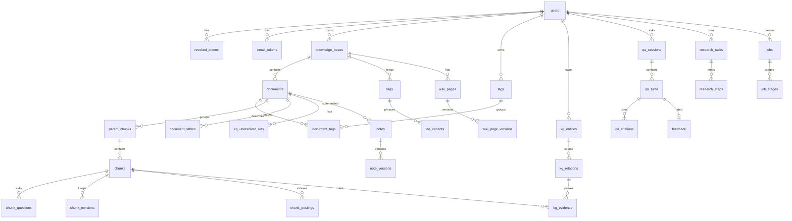

# 研智助手 数据设计

| 项目 | 内容 |
| --- | --- |
| 文档版本 | v0.2（草稿） |
| 日期 | 2026-10-04 |
| 需求基线 | [requirements.md](../requirements/requirements.md) 1.0 |
| 修订 | v0.2 按需求 1.0 重做：新增知识库、父块、预生成问法、表格列说明、图谱、深度查阅、Wiki 版本、FAQ 问法、推荐问题、通用任务表、外部检索密钥、来源同步和偏好表；删去邀请码、绑定、项目、任务、评论、通知、Agent 任务和会话分叉列；模型密钥改为 AES-GCM。完整修订记录见 [architecture.md](architecture.md) |
| 关联文档 | [architecture.md](architecture.md)、[api-design.md](api-design.md)、[ADR-001.md](ADR-001.md) |

数据库是一个 PostgreSQL，只由 Go 主服务连接；docreader 不连数据库。向量类型由 pgvector 提供。图谱也用普通表，不另部署图数据库（C-02）。时间列都是 `timestamptz`。业务上的「北京时间」在写入前换算，不另存无时区的本地时间。

主键都是 UUID。下面的「必填」指 `NOT NULL`。所有个人资源表都有 `owner_id`，或能经外键一步回到带 `owner_id` 的行。

## 1 关系



`model_configs`、`embedding_generations` 不属于用户，图中不画。`kg_relations` 另有一条到 `kg_entities` 的 `target` 外键，图中只画一条以免交叉。可以级别的表见第 8 节。

## 2 身份

### users

| 列 | 类型 | 约束 | 说明 |
| --- | --- | --- | --- |
| id | uuid | 主键 | |
| email | text | 唯一，必填 | 登录名，比较前转小写 |
| name | text | 必填 | 显示姓名 |
| password_hash | text | 必填 | bcrypt，不存明文 |
| role | text | 必填 | `user`、`admin`。管理员只由命令行创建 |
| email_verified_at | timestamptz | 可空 | 空表示未验证 |
| tokens_invalid_before | timestamptz | 可空 | 改密码或重置密码后，更早签发的令牌失效 |
| storage_bytes | bigint | 必填，默认 0 | 原始文件字节合计 |
| created_at | timestamptz | 必填 | |

管理员行的 `storage_bytes` 永远为 0，名下没有知识库。

### revoked_tokens

| 列 | 类型 | 约束 | 说明 |
| --- | --- | --- | --- |
| jti | uuid | 主键 | 退出的那一枚令牌 |
| user_id | uuid | 外键 users，必填 | |
| expires_at | timestamptz | 必填 | 原令牌过期时间。过期行可以清理 |

退出只插入当前 `jti`。修改密码和重置密码不逐枚插入，而是更新 `users.tokens_invalid_before`。

### email_tokens

| 列 | 类型 | 约束 | 说明 |
| --- | --- | --- | --- |
| id | uuid | 主键 | |
| user_id | uuid | 外键，必填 | |
| purpose | text | 必填 | `verify` 或 `reset` |
| token_hash | text | 必填 | 只存哈希 |
| expires_at | timestamptz | 必填 | 验证 24 小时，重置 30 分钟 |
| used_at | timestamptz | 可空 | 非空则不能再用 |

## 3 知识库、资料、切块与索引

### knowledge_bases

| 列 | 类型 | 约束 | 说明 |
| --- | --- | --- | --- |
| id | uuid | 主键 | |
| owner_id | uuid | 外键 users，必填 | |
| name | text | 必填 | 1～50 个字符 |
| answer_instruction | text | 可空 | FR-13 回答说明，空则用系统默认 |
| retrieval_threshold | numeric(4,3) | 可空 | FR-13 检索阈值，空则用系统默认 0.3 |
| graph_enabled | boolean | 必填，默认 true | FR-07，资料完成后是否抽取图谱 |
| created_at | timestamptz | 必填 | |
| updated_at | timestamptz | 必填 | |

索引：`(owner_id, created_at)`，满足知识库列表的 NFR-01。

### documents

表名沿用 `documents`，对应需求中的「资料」。

| 列 | 类型 | 约束 | 说明 |
| --- | --- | --- | --- |
| id | uuid | 主键 | |
| owner_id | uuid | 外键 users，必填 | |
| kb_id | uuid | 外键 knowledge_bases，必填 | 一份资料属于一个知识库 |
| source_type | text | 必填 | `pdf`、`docx`、`pptx`、`xlsx`、`csv`、`epub`、`html`、`md`、`txt`、`image`、`audio`、`url`、`text` |
| title | text | 必填 | 出处标题用此列，不翻译 |
| authors | jsonb | 必填，默认 `[]` | 字符串数组 |
| year | integer | 可空 | 引用导出所需要的年份。空则该篇不能导出 |
| venue | text | 可空 | 期刊或会议 |
| volume | text | 可空 | |
| issue | text | 可空 | |
| pages | text | 可空 | 印刷页码范围，只给引用格式用 |
| doi | text | 可空 | |
| extra_meta | jsonb | 必填，默认 `{}` | 学位、出版社等模板字段 |
| status | text | 必填 | `pending`、`parsing`、`embedding`、`ready`、`failed` |
| failure_reason | text | 可空 | 给用户看的原因，用验收里的原句 |
| graph_status | text | 可空 | `pending`、`extracting`、`ready`、`failed`。资料未完成或库未启用图谱时为空 |
| graph_failure_reason | text | 可空 | |
| graph_manual_retry_count | integer | 必填，默认 0 | 只计用户点击的抽取重试 |
| sha256 | char(64) | 可空 | 十六进制。网页资料在抓取后写入 |
| size_bytes | bigint | 必填，默认 0 | 计入配额 |
| page_count | integer | 可空 | 读不出则为空 |
| has_physical_pages | boolean | 必填，默认 true | 只有 PDF 为 true；其他来源出处用第 1 页 |
| skipped_pages | integer[] | 必填，默认 `{}` | 抽不出文本的物理页，不重排 |
| relative_path | text | 可空 | 文件夹上传时的相对路径 |
| storage_key | text | 可空 | 文件卷内部键，不是 URL。网页资料为空 |
| source_url | text | 可空 | 网页或订阅源条目的地址 |
| feed_id | uuid | 可空 | 来自哪个订阅源 |
| manual_retry_count | integer | 必填，默认 0 | 只计用户点击的入库重试 |
| cancel_requested | boolean | 必填，默认 false | 删除处理中资料时置位 |
| embedding_generation | bigint | 必填 | 入队时复制当时的活动代际 |
| created_at | timestamptz | 必填 | |
| updated_at | timestamptz | 必填 | |

部分唯一约束：`(owner_id, sha256) WHERE sha256 IS NOT NULL`。判重在用户范围内，跨知识库也算重复，409 给出已有资料的知识库。失败记录重新上传时更新这一行的 `status`，不插入第二行。不同用户可以拥有相同哈希。

索引：`(owner_id, status)`，`(owner_id, kb_id, created_at)`。标题搜索用 `pg_trgm` 的 GIN `(lower(title))`。列表查询都带 `owner_id`。

`storage_key` 形如 `{owner_id}/{document_id}`。接口不返回这个值。

### parent_chunks

| 列 | 类型 | 约束 | 说明 |
| --- | --- | --- | --- |
| id | uuid | 主键 | |
| document_id | uuid | 外键，级联删除，必填 | |
| position | integer | 必填 | 在资料内从 1 递增 |
| page_start | integer | 必填 | 第一个子块的起始页 |
| text | text | 必填 | 子块新正文的拼接，约 2000～3000 字符 |

父块不进向量，不进关键词索引，不单独成为出处。

### chunks

| 列 | 类型 | 约束 | 说明 |
| --- | --- | --- | --- |
| id | uuid | 主键 | |
| document_id | uuid | 外键，级联删除，必填 | |
| parent_id | uuid | 外键 parent_chunks，必填 | |
| kind | text | 必填 | `text`、`table`、`ocr`、`image_caption`、`transcript` |
| page_start | integer | 必填 | 物理页，从 1 开始。跨页取起始页 |
| paragraph_index | integer | 必填 | 出处接口不返回 |
| overlap_prefix | integer | 必填，默认 0 | 开头与上一块重叠的字符数，用于重建父块 |
| text | text | 必填 | 当前文本 |
| version_no | integer | 必填，默认 1 | 每次修订加 1 |
| char_count | integer | 必填 | |
| term_count | integer | 必填 | BM25 的文档长度，含问法词项 |
| embedding | vector | 可空 | 维度等于当前向量配置。未完成或已作废时为空 |
| embedding_generation | bigint | 必填 | 与写入时的活动代际一致 |
| created_at | timestamptz | 必填 | |
| updated_at | timestamptz | 必填 | |

索引：

- `(document_id, paragraph_index)`
- `(parent_id)`
- 向量列在规模超过单用户 5000 块、且 EXPLAIN 显示精确扫描超出预算时再建 HNSW

检索 SQL 必须同时写上这些谓词：资料所有者等于当前用户，资料状态为 `ready`，切块代际等于活动代际，`embedding IS NOT NULL`（向量路），再加上知识库、标签或资料 ID 范围。禁止先取全局最近邻再在应用里丢掉别人的块。

5000 块的预算内，向量路使用 `ORDER BY embedding <=> :query LIMIT 20`，距离算子对应余弦。相似度 = `1 - 余弦距离`。阈值作用在这个相似度上，并且只约束向量路。

### chunk_questions

| 列 | 类型 | 约束 | 说明 |
| --- | --- | --- | --- |
| id | uuid | 主键 | |
| chunk_id | uuid | 外键 chunks，级联删除，必填 | |
| text | text | 必填 | 预生成的问法 |
| embedding | vector | 可空 | |
| embedding_generation | bigint | 必填 | |

每个切块最多 3 行，由应用在写入时保证。问法的词项以 `field = 'question'` 写入所属切块的 `chunk_postings`。切块修订时删除旧问法，重建任务再生成。

### chunk_revisions

修订切块时，把旧 `text` 和旧 `version_no` 插入此表，再更新 `chunks.text`、加版本号并清空该块向量，等待重新向量化。列：`id`，`chunk_id`，`version_no`，`text`，`created_at`。只有所有者能触发写入。

### chunk_postings 与 term_stats

关键词路实现 BM25，不用数据库自带的 `ts_rank` 代替 BM25。

`chunk_postings(chunk_id, term, field, tf)`，主键 `(chunk_id, term, field)`，`field` 为 `text` 或 `question`，索引 `(term, chunk_id)`。

`term_stats(owner_id, term, df)`，主键 `(owner_id, term)`。`df` 是该用户资料中含这个词的切块数。切块写入、修订、删除时在同一事务里增减。

分词规则：

- 匹配 `[A-Za-z0-9]+(?:-[A-Za-z0-9]+)*`，因此 `Zephyr-Bench-9` 是一个词。
- 连续 CJK 字符按字二元组。
- 英文词转小写，`Zephyr-Bench-9` 的匹配键是 `zephyr-bench-9`。提问侧用同一分词器。

BM25 参数 k1 = 1.2，b = 0.75，写在配置里。平均文档长度按该用户的 `chunks.term_count` 计算。候选先由词项命中集合限定在所有者和范围内，再计算分数，取前 20。这一步不读取向量分数。

RRF 在主服务里融合两路名次。常数 k = 60。融合后的前若干条才送给重排或直接取 Top-K = 5。

### document_tables

`document_tables(id, document_id, page_no, name, columns jsonb, chunk_id)`。`columns` 是 `[{name, inferred_type}]`。只为 xlsx 和 csv 写入，供深度查阅的「查看已导入表格的列说明」动作读取。`chunk_id` 指向含该表格文本的切块，作为出处。

### tags、document_tags

`tags(id, owner_id, name, created_at)`，唯一 `(owner_id, name)`。`name` 长度 1～50。标签属于用户，可以用于该用户任何知识库里的资料。

`document_tags(document_id, tag_id)`，主键为这两列。删除标签删除关联行，不删除资料。

## 4 问答、笔记与 FAQ

### qa_sessions

| 列 | 类型 | 约束 | 说明 |
| --- | --- | --- | --- |
| id | uuid | 主键 | |
| owner_id | uuid | 外键，必填 | |
| title | text | 必填 | 默认可取首问前 30 字 |
| created_at | timestamptz | 必填 | |
| updated_at | timestamptz | 必填 | 列表按此倒序 |

查询必须带 `owner_id`。

### qa_turns

| 列 | 类型 | 约束 | 说明 |
| --- | --- | --- | --- |
| id | uuid | 主键 | |
| session_id | uuid | 外键，级联删除，必填 | |
| question | text | 必填 | |
| answer | text | 必填 | 校验之后的文本。拒答时为固定句 |
| answer_kind | text | 必填 | `kb`、`faq`、`smalltalk`、`web`、`refused` |
| rewritten | boolean | 必填 | 只表示是否改写成功，不另存一份改写后的查询 |
| reranked | boolean | 必填 | 是否执行了重排 |
| web_search | boolean | 必填 | 这一问是否打开了公开网页检索 |
| scope | jsonb | 必填 | 用户选择的范围 |
| candidate_ids | uuid[] | 必填，默认 `{}` | 见第 17 节 |
| graph_extra_ids | uuid[] | 必填，默认 `{}` | 图谱补充的切块 |
| created_at | timestamptz | 必填 | |

追问组装上下文时取同一会话最近 5 条 `qa_turns`。

### qa_citations

| 列 | 类型 | 约束 | 说明 |
| --- | --- | --- | --- |
| id | uuid | 主键 | |
| turn_id | uuid | 外键，级联删除，必填 | |
| chunk_id | uuid | 外键 chunks，`ON DELETE SET NULL` | 删资料后变空 |
| document_id | uuid | 可空 | 资料删除后变空 |
| title_snapshot | text | 必填 | 删除后仍能显示标题 |
| page_start | integer | 可空 | FAQ 和网页来源为空 |
| origin | text | 必填 | `kb`、`faq`、`web` |
| graph_supplement | boolean | 必填，默认 false | 来自图谱补充 |
| label | text | 必填 | 库内为「标题, 第 X 页」。资料已删时接口改显示「来源已删除」 |
| external_url | text | 可空 | 网页地址 |

只插入本次候选或图谱补充里出现过的 `chunk_id`。校验函数不接收模型自由填写的页码作为入库依据。页码来自 `chunks.page_start`。

### notes 与 note_versions

`notes(id, document_id, owner_id, current_version_id, created_at)`。

`note_versions(id, note_id, version_no, body, created_at)`。`body` 是五个小节的 JSON。每个小节含 `citations: [{chunk_id, page_start}]`。写入前丢掉对不上该资料切块的标记。重新生成并保存增加 `version_no`，不覆盖旧行。

### faqs 与 faq_variants

`faqs(id, owner_id, kb_id, question, answer, question_embedding, embedding_generation, created_at, updated_at)`。

`faq_variants(id, faq_id, kind, text, embedding)`。`kind` 为 `similar`（相似问法）或 `negative`（不应命中的问法）。删除 FAQ 时级联删除问法。匹配发生在混合检索之前，规则见 module-design.md 第 10 节。

### suggested_questions

`suggested_questions(id, owner_id, scope_type, scope_id, questions jsonb, source_fingerprint, generated_at)`。`scope_type` 为 `document` 或 `kb`。`questions` 最多 5 条。`source_fingerprint` 是生成时该范围内已完成资料 ID 与版本的哈希，不一致即视为过期。唯一 `(scope_type, scope_id)`。

### feedback

`feedback(id, user_id, turn_id, vote, reason, created_at, updated_at)`。`vote` 为 `up` 或 `down`；`reason` 为 `source_wrong`、`off_topic`、`incomplete`、`relation_wrong`、`other`，只在点踩时有值。唯一 `(user_id, turn_id)`，改选时更新这一行。导出统计按 `updated_at` 的北京时间日期分组，不读 `qa_turns` 的正文。

## 5 图谱

### kg_entities

| 列 | 类型 | 约束 | 说明 |
| --- | --- | --- | --- |
| id | uuid | 主键 | |
| owner_id | uuid | 外键 users，必填 | |
| type | text | 必填 | `paper`、`author`、`method`、`dataset`、`metric`、`problem`，即文献、作者、方法、数据集、指标、研究问题 |
| name | text | 必填 | 展示名，取第一次出现的写法 |
| merge_key | text | 必填 | 去掉首尾空白、合并连续空白、拉丁字母转小写 |
| document_id | uuid | 外键 documents，`ON DELETE SET NULL` | 仅文献节点，指向对应资料 |
| created_at | timestamptz | 必填 | |

唯一 `(owner_id, merge_key)`：同一用户内名称相同的实体只有一个，不同用户互不合并。同名但模型给出不同类型时保留已有类型，这一点随 OQ-11 一起确认。

### kg_relations

| 列 | 类型 | 约束 | 说明 |
| --- | --- | --- | --- |
| id | uuid | 主键 | |
| owner_id | uuid | 外键，必填 | |
| type | text | 必填 | `author_of`、`proposes`、`uses_dataset`、`reports_metric`、`addresses`、`compares_with`、`cites` |
| source_id | uuid | 外键 kg_entities，级联删除，必填 | |
| target_id | uuid | 外键 kg_entities，级联删除，必填 | |
| suspended | boolean | 必填，默认 false | 暂停参与问答补充，见第 9 节 |
| created_at | timestamptz | 必填 | |

唯一 `(owner_id, type, source_id, target_id)`。关系类型依次对应作者属于文献、文献提出方法、使用数据集、报告指标、针对研究问题、对比、文献引用文献。

### kg_evidence

| 列 | 类型 | 约束 | 说明 |
| --- | --- | --- | --- |
| id | uuid | 主键 | |
| relation_id | uuid | 外键 kg_relations，级联删除，必填 | |
| document_id | uuid | 外键 documents，级联删除，必填 | |
| chunk_id | uuid | 外键 chunks，级联删除，必填 | |
| chunk_version | integer | 必填 | 抽取时切块的版本号 |
| page_start | integer | 必填 | 复制自切块 |
| sentence | text | 必填 | 证据句，必须是切块文本的子串 |
| created_at | timestamptz | 必填 | |

索引：`(chunk_id)`、`(relation_id)`、`(document_id)`。每条关系至少一条证据；事务结束时若某关系没有证据，同一事务里删掉该关系。

### kg_unresolved_refs

`kg_unresolved_refs(id, document_id, title, created_at)`。引用题名对不上本人库内已完成资料时写入，不建成可打开的节点。资料删除时级联删除。

## 6 深度查阅、Wiki 与模型配置

### research_tasks

| 列 | 类型 | 约束 | 说明 |
| --- | --- | --- | --- |
| id | uuid | 主键 | |
| owner_id | uuid | 外键，必填 | |
| question | text | 必填 | |
| scope | jsonb | 必填 | |
| status | text | 必填 | `running`、`stopped`、`failed`、`completed` |
| step_limit | integer | 必填，默认 8 | |
| stop_requested | boolean | 必填，默认 false | |
| failed_step | integer | 可空 | |
| answer | text | 可空 | 校验后的最终回答 |
| request_id | uuid | 必填 | |
| created_at | timestamptz | 必填 | |
| finished_at | timestamptz | 可空 | |

### research_steps

| 列 | 类型 | 约束 | 说明 |
| --- | --- | --- | --- |
| id | uuid | 主键 | |
| task_id | uuid | 外键，级联删除，必填 | |
| position | integer | 必填 | 从 1 开始 |
| action | text | 必填 | `search_kb`、`read_chunks`、`list_documents`、`query_graph`、`search_wiki`、`table_columns`、`answer` |
| params_summary | jsonb | 必填 | 查询词、资料 ID 等，不含正文 |
| result_refs | jsonb | 可空 | 切块 ID、标题、页码；不含切块全文 |
| status | text | 必填 | `running`、`succeeded`、`failed` |
| started_at | timestamptz | 必填 | |
| elapsed_ms | integer | 可空 | |

`research_citations(task_id, chunk_id, document_id, title_snapshot, page_start, label)` 保存最终回答的出处，规则同 `qa_citations`。没有 `resume_from` 列，再次查阅是新的 `research_tasks` 行。

### wiki_pages、wiki_page_versions、wiki_links

`wiki_pages(id, owner_id, kb_id, title, current_version_id, created_at, updated_at)`，唯一 `(kb_id, title)`。

`wiki_page_versions(id, page_id, version_no, body, sources jsonb, origin, created_at)`。`sources` 为 `[{chunk_id, document_id, page_start, title_snapshot}]`，至少一条。`origin` 为 `generated`、`edited` 或 `restored`。保存和恢复都插入新行，不更新旧行。

`wiki_links(from_page_id, to_page_id)`，主键为这两列，按当前版本重算。

生成任务的状态记在 `jobs`（`kind = wiki_generate`，`target_id = kb_id`）。

### model_configs

| 列 | 类型 | 约束 | 说明 |
| --- | --- | --- | --- |
| kind | text | 主键 | `chat`、`embedding`、`rerank`、`vision` |
| base_url | text | 必填 | |
| model_name | text | 必填 | |
| api_key_nonce | bytea | 必填 | AES-GCM 的 12 字节随机数，每次保存重新生成 |
| api_key_ciphertext | bytea | 必填 | AES-256-GCM 密文含认证标签 |
| api_key_last4 | char(4) | 必填 | 只用于界面掩码 |
| key_version | integer | 必填 | 主密钥轮换时区分 |
| dimension | integer | 可空 | 仅向量使用 |
| updated_at | timestamptz | 必填 | |

全表最多四行，不按用户复制。

### embedding_generations

| 列 | 类型 | 约束 | 说明 |
| --- | --- | --- | --- |
| id | bigint | 主键，递增 | 代际 |
| model_name | text | 必填 | |
| dimension | integer | 必填 | |
| active | boolean | 必填 | 同时只有一行是 true |

确认重建时：插入新行并把它标为唯一活动行，清空 `chunks`、`chunk_questions` 和 `faqs`、`faq_variants` 的向量，`UPDATE documents SET status = 'pending'`，`UPDATE kg_relations SET suspended = true`，并为每份资料创建 `reembed` 任务。检索条件使用活动代际。维度变化时，迁移在同一次管理操作中删除并重建这些向量列，类型为 `vector(新维度)`。

## 7 日志

### model_call_logs

| 列 | 类型 | 约束 | 说明 |
| --- | --- | --- | --- |
| id | uuid | 主键 | |
| request_id | uuid | 必填 | 后台任务用创建它的请求的 request_id |
| user_id | uuid | 可空 | 系统任务可空 |
| kind | text | 必填 | `qa`、`smalltalk`、`rewrite`、`embed`、`rerank`、`vision_ocr`、`vision_caption`、`question_gen`、`graph_extract`、`suggest`、`notes`、`research`、`wiki` |
| model | text | 必填 | |
| elapsed_ms | integer | 必填 | |
| prompt_tokens | integer | 必填 | |
| completion_tokens | integer | 必填 | |
| status | text | 必填 | `ok`、`error`、`skipped` |
| prompt_sha256 | char(64) | 可空 | 只有哈希 |
| created_at | timestamptz | 必填 | |

此表没有提示词列，没有回答列，没有密钥列。索引 `(created_at)`、`(user_id, created_at)`、`(kind, created_at)`。

### request_logs

`request_id`、`user_id`、`method`、`path`、`status_code`、`elapsed_ms`、`created_at`。路径参数里的资料 ID 可以保留。查询串若带口令则不记录。

资料处理和图谱抽取的日志来自 `job_stages`，深度查阅的日志来自 `research_steps` 的元数据列。管理员按类型筛选时分别读这几张表。

主服务的 stdout 也是 JSON，字段含 `request_id`。docreader 的 stdout 同样是 JSON，带主服务传来的 `request_id`，不写文件正文。日志扫描测试同时扫两边的 stdout 和这些表。

## 8 可以级别的表

做到对应需求时再迁移，避免前两个切片背上无用写入。

| 表 | 列 | FR |
| --- | --- | --- |
| api_keys | `id`、`owner_id`、`name`、`prefix`、`key_sha256`、`created_at`、`revoked_at`、`last_used_at` | FR-26 |
| feeds | `id`、`owner_id`、`kb_id`、`url`、`kind`（`rss` 或 `page`）、`status`、`failure_reason`、`last_checked_at`、`next_check_at`、`created_at` | FR-27 |
| feed_items | `feed_id`、`item_key`（条目链接或正文哈希）、`document_id`、`first_seen_at`，唯一 `(feed_id, item_key)` | FR-27 |
| preferences | `id`、`owner_id`、`kind`（`salutation` 或 `answer_language`）、`value`、`status`（`proposed` 或 `confirmed`）、`created_at`、`confirmed_at` | FR-28 |

`feedback` 已在第 4 节，属于 FR-25。

这些表都带 `owner_id`。策略与资料相同：其他用户和管理员都是 404。`feeds.next_check_at` 至少比 `last_checked_at` 晚 24 小时。`preferences` 唯一 `(owner_id, kind) WHERE status = 'confirmed'`，只有已确认的行进入提示词。

## 9 状态机

资料状态只允许下面的迁移。

| 从 | 到 | 谁触发 |
| --- | --- | --- |
| 无 | `pending` | 上传或导入成功 |
| `failed` | `pending` | 相同 SHA-256 再上传，或手动重试 |
| `ready` | `pending` | 向量模型确认更换，等待重新向量化 |
| `pending` | `parsing` | worker 认领入库任务 |
| `pending` | `embedding` | worker 认领重新向量化任务，不经过解析 |
| `parsing` | `embedding` | 切块已写入 |
| `embedding` | `ready` | 向量和词项都已提交 |
| `parsing` 或 `embedding` | `failed` | 处理错误，或启动回收 |
| 任意 | 行消失 | 所有者硬删除 |

启动回收的条件是进程开始时状态属于 `parsing` 或 `embedding`。它把状态改为 `failed`，`failure_reason` 写成「处理中断，请重试」，`manual_retry_count` 不变。

图谱状态：

| 从 | 到 | 谁触发 |
| --- | --- | --- |
| 空 | `pending` | 资料变为已完成且库启用图谱 |
| `ready` 或 `failed` | `pending` | 切块修订、向量重建后再次完成、手动重试 |
| `pending` | `extracting` | worker 认领 |
| `extracting` | `ready` | 证据写入完成 |
| `extracting` | `failed` | 自动重试 2 次后仍失败，或启动回收（原因为处理中断，不计入手动重试） |

关系的 `suspended`：切块修订时，以该块为证据的关系置 true；向量模型确认更换时全部置 true；该资料重新抽取完成后，证据切块版本等于当前版本、证据句仍在当前文本里的关系置回 false，其余的证据删除，没有证据的关系删除。

认领语句的语义：

```sql
UPDATE jobs
SET status = 'running', started_at = now(), heartbeat_at = now()
WHERE id = (
  SELECT j.id FROM jobs j
  WHERE j.status = 'pending' AND j.kind = ANY(:kinds)
  ORDER BY j.priority, j.created_at
  FOR UPDATE SKIP LOCKED
  LIMIT 1
)
RETURNING *;
```

同一事务里再把对应资料从 `pending` 改为 `parsing`（或 `embedding`），或把图谱状态从 `pending` 改为 `extracting`。资料的 `cancel_requested` 为 true 时，worker 认领后立即把任务标为 `cancelled`，不调用 docreader。

深度查阅不从 `failed` 或 `stopped` 回到 `running`。停止只允许从 `running` 到 `stopped`。

## 10 删除与事务

删除资料：

1. 将 `cancel_requested` 置位并提交，等待 worker 退出或确认尚未认领。
2. 删除文件卷中的对象。
3. 删除 `documents` 行。父块、切块、问法、词项、修订、表格列说明、标签关联、任务、证据、未入库引用随外键级联。
4. `qa_citations.chunk_id`、`research_citations.chunk_id` 被置空。`users.storage_bytes` 减去 `size_bytes`。
5. `term_stats.df` 按被删词项减少。
6. 图谱清理：删除没有剩余证据的 `kg_relations`；指向被删资料文献节点的 `cites` 关系删除，被引题名写回引用方的 `kg_unresolved_refs`；删除不再连接任何关系、且 `document_id` 不指向仍存在资料的实体，包括被删资料自己的文献节点。

第 2 步失败则事务回滚数据库删除，并留下可重试的删除标记。不把向量留在可检索状态。

历史出处的显示规则在读取时计算：`chunk_id IS NULL AND origin = 'kb'` 则标签为「来源已删除」。

## 11 配额、代际与时间

存储配额的比较使用 `storage_bytes + :new_size > 2147483648`。计数的是原始文件，不是切块文本。手工录入的文本按 UTF-8 字节数计入。

活动向量代际是检索谓词的一部分。旧代际的向量即使还没被清空语句扫到，也不能命中。清空语句仍要执行，避免维度不一致的列被读到。

订阅源的检查：定时器每小时选出 `next_check_at <= now()` 的来源创建 `feed_sync` 任务，完成后 `next_check_at = now() + interval '24 hours'`。同一条目以 `feed_items` 的唯一约束去重，同一天内再次同步不会重复创建资料。

## 12 容量

按 NFR-02 的单库 5000 个切块估算。1024 维 float32 向量约 5000 × 1024 × 4 ≈ 20 MB；每块最多 3 个问法，问法向量最多再加 60 MB。父块不进向量。加上 HNSW 或精确扫描的内存开销，单机 PostgreSQL 足够。图谱按每块平均几条证据估算，证据表在十万行以内。原文上限是每用户 2 GB。课程部署按数十用户规划磁盘，不按多租户集群规划。

这个规模也是不引入独立检索引擎和图数据库的数据依据。超过该规模时先看 EXPLAIN 和 P95，再考虑 HNSW，而不是把过滤从 SQL 中拿掉。

## 13 任务表

资料五态和图谱状态给用户看。任务、阶段和心跳放在任务表，避免把「解析中」拆成更多对外状态。C-02 要求处理任务记在数据库中，由主服务的 worker 领取，这张表就是队列。

### jobs

| 列 | 类型 | 约束 | 说明 |
| --- | --- | --- | --- |
| id | uuid | 主键 | |
| kind | text | 必填 | `ingest`、`reembed`、`chunk_reindex`、`question_gen`、`graph_extract`、`suggest`、`wiki_generate`、`feed_sync`、`mail_send` |
| owner_id | uuid | 可空 | 发信任务可空 |
| target_id | uuid | 必填 | 资料、切块、知识库或订阅源的 ID |
| request_id | uuid | 必填 | 创建它的请求或上游任务的 request_id |
| priority | integer | 必填，默认 100 | 入库优先于后台生成 |
| attempt | integer | 必填 | 从 1 开始。手动重试和失败后再上传都新建一行 |
| status | text | 必填 | `pending`、`running`、`succeeded`、`failed`、`cancelled` |
| heartbeat_at | timestamptz | 可空 | 每个阶段开始和每批向量写入时更新 |
| error_message | text | 可空 | 与资料或图谱的失败原因相同 |
| created_at | timestamptz | 必填 | |
| started_at | timestamptz | 可空 | |
| finished_at | timestamptz | 可空 | |

部分唯一索引：同一 `(kind, target_id)` 同时只能有一行 `status IN ('pending', 'running')`。

### job_stages

| 列 | 类型 | 约束 | 说明 |
| --- | --- | --- | --- |
| id | uuid | 主键 | |
| job_id | uuid | 外键，级联删除，必填 | |
| name | text | 必填 | 入库为 `fetch`、`parse`、`recognize`、`chunk`、`embed`；抽取为 `extract`、`merge` |
| status | text | 必填 | `pending`、`running`、`succeeded`、`failed`、`skipped` |
| detail | jsonb | 可空 | 批次数、跳过页数等计数，不含正文 |
| started_at | timestamptz | 可空 | |
| finished_at | timestamptz | 可空 | |

唯一 `(job_id, name)`。

入库任务失败时，本轮 `chunks`、`parent_chunks`、`chunk_postings` 和空向量一起删除，再把资料改为 `failed`。删除和改状态在一个事务里。文件卷上的原件保留，供手动重试。

## 14 页块不单独成库

docreader 返回的页块只在一次任务的内存里存在。切块提交后，页块丢弃。保留它们会把全文再存一遍，和「日志不存全文」的隐私目标冲突，也增大 2 GB 配额之外的数据库体积。全篇无文本时 docreader 交出的页面图片同样只在识别期间存在。

切块上已经有恢复出处所需的最小集合：`page_start`、`paragraph_index`、`text`。修订只改 `text` 并追加 `chunk_revisions`。`page_start` 没有更新语句。

不保存字符偏移。切块一旦可修订，偏移就不再等于原文位置。出处定位以页码加切块文本为准。

## 15 切块链与父子块

`chunks` 另有两列可空外键，都指向 `chunks.id`：

| 列 | 说明 |
| --- | --- |
| prev_chunk_id | 同一资料、同一轮切块中的上一块 |
| next_chunk_id | 下一块 |

它们只用于删除时把链拆开，以及界面按顺序展示。问答提示词不读取邻居的文本，上下文由 `parent_id` 指向的父块提供。

父块文本等于其子块去掉 `overlap_prefix` 后的拼接。子块修订时，同一事务里把该块 `overlap_prefix` 置 0，并重写所属父块的 `text`。

## 16 幂等键

### idempotency_keys

| 列 | 类型 | 约束 | 说明 |
| --- | --- | --- | --- |
| id | uuid | 主键 | |
| user_id | uuid | 外键，必填 | |
| key | text | 必填 | 请求头原文，最长 200 字符 |
| request_hash | char(64) | 必填 | 文件 SHA-256 加表单元数据的哈希 |
| document_id | uuid | 外键，可空 | 第一次成功创建或复用的资料 |
| status_code | integer | 必填 | 第一次返回给客户端的状态码 |
| created_at | timestamptz | 必填 | |

唯一 `(user_id, key)`。超过 24 小时的行由定时器每日删除。过期之后的相同键按新请求处理。

## 17 问答候选快照

`qa_turns.candidate_ids` 是送进模型的 Top-K 切块 ID，顺序与别名 `c1` 起的顺序一致；`graph_extra_ids` 是图谱补充的切块，对应 `g1` 起。别名不入库。

评测断言：该轮每条 `origin = kb` 的引用，其 `chunk_id` 都在 `candidate_ids` 或 `graph_extra_ids` 中。拒答轮次 `qa_citations` 必须为空；实现保留检索候选，方便区分「没检索到」和「检索到了但没有被引用」。没检索到时 `candidate_ids` 为空。寒暄和 FAQ 轮次两列都为空。

网页条目不放进 `candidate_ids`。它们只在 `qa_citations.origin = 'web'` 的行里，且 `chunk_id` 为空。

## 18 运行配置的存放

| 配置 | 存放 | 原因 |
| --- | --- | --- |
| JWT 密钥、AES-GCM 主密钥、docreader 共享口令、数据库连接串、SMTP 参数 | 环境变量 | 不进库，不进日志 |
| 切块长度、重叠、父块长度、Top-K、RRF k、BM25 参数、默认阈值、FAQ 阈值、并发和批大小、是否预生成问法、深度查阅步数上限 | 环境变量 | 改动需要部署，避免界面上随时改检索定义 |
| 知识库的回答说明、检索阈值、是否启用图谱 | `knowledge_bases` | FR-13、FR-07 要求按库设置 |
| 模型地址、模型名、密文密钥、向量维度 | `model_configs` | FR-08 要求页面可改 |
| 向量代际 | `embedding_generations` | 和向量列一起切换 |
| 提示词正文 | 代码目录 `prompts/` | 变更走代码评审 |

不建通用的键值设置表。系统默认阈值若要改，改环境变量并在发布说明里写明。OQ-08 关闭之前，默认值保持余弦相似度 0.3。

## 19 删除时的行顺序

一个事务内的顺序：

1. `documents.cancel_requested = true` 先单独提交，让 worker 在阶段边界能看见。
2. 等待运行中的任务结束或被心跳检查收口，最多 10 秒。
3. 新事务：删除文件卷对象；删除 `documents` 行，相关行随外键级联。
4. 同一事务里减少 `users.storage_bytes` 和 `term_stats.df`，执行第 10 节第 6 步的图谱清理。
5. 出处表的 `chunk_id` 置空。`qa_turns.candidate_ids` 保留原 UUID。那些 UUID 不再指向行，读引用时发现 `chunk_id` 为空就显示「来源已删除」。

第 2 步超时后仍进入第 3 步。worker 在插入切块前再读资料是否存在；资料已删除则丢弃本轮结果，不再插入。

## 20 索引清单补充

| 索引 | 用途 |
| --- | --- |
| `jobs (kind, target_id) WHERE status IN ('pending','running')` 唯一 | 同一对象只有一个在途任务 |
| `jobs (status, kind, priority, created_at)` | 认领 |
| `jobs (status, heartbeat_at)` | 心跳扫描 |
| `idempotency_keys (user_id, key)` 唯一 | 幂等 |
| `idempotency_keys (created_at)` | 过期清理 |
| `chunk_postings (term, chunk_id)` | 关键词候选 |
| `chunks (document_id, paragraph_index)` | 按顺序读切块 |
| `kg_evidence (chunk_id)` | 图谱补充和切块修订时找关系 |
| `kg_relations (owner_id, source_id)`、`kg_relations (owner_id, target_id)` | 一跳查询 |
| `kg_entities (owner_id, merge_key)` 唯一 | 合并 |
| `faq_variants (faq_id)` | FAQ 匹配 |
| `wiki_pages (kb_id, title)` 唯一 | 主题页同名合并 |

向量检索和图谱补充的过滤列不靠应用层。查询文本在测试里固定包含 `documents.owner_id`、`documents.status = 'ready'` 和 `chunks.embedding_generation`；图谱补充另含 `kg_relations.suspended = false`。
