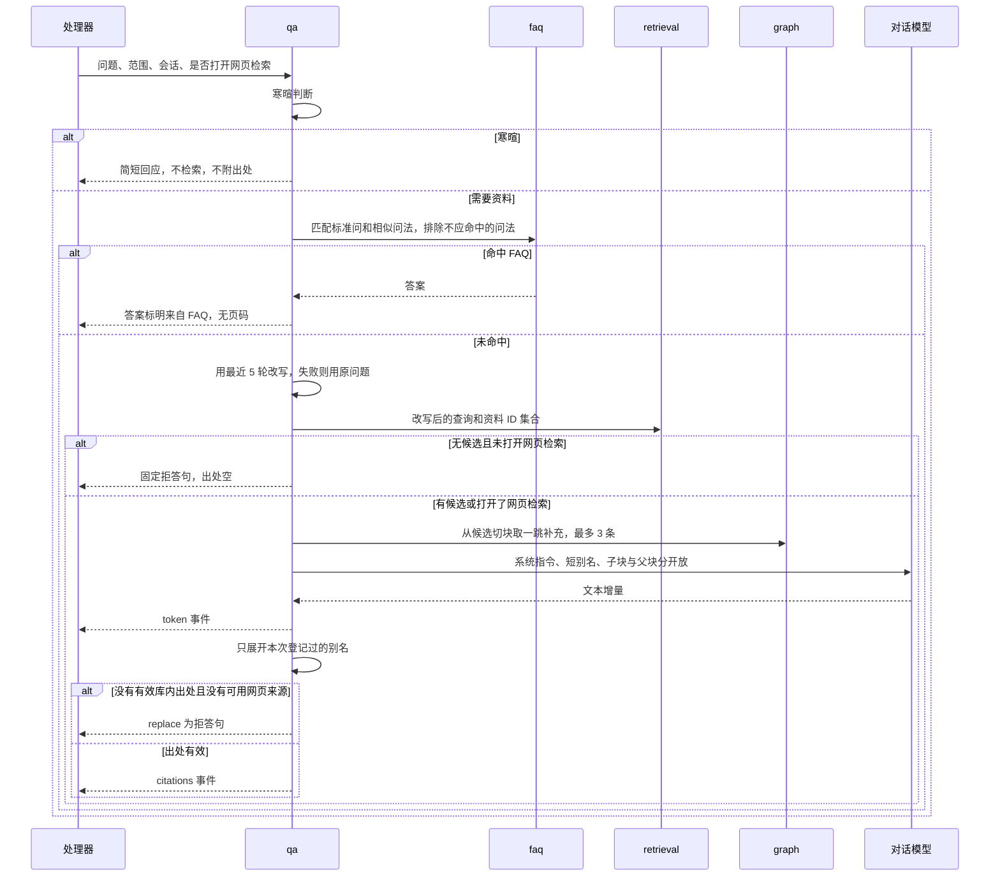

# 研智助手 模块设计

| 项目 | 内容 |
| --- | --- |
| 文档版本 | v0.2（草稿） |
| 日期 | 2026-10-04 |
| 需求基线 | [requirements.md](../requirements/requirements.md) 1.0 |
| 修订 | v0.2 按需求 1.0 重做：模块改为 Go 包，新增 knowledge、graph、research、wiki、faq、jobs、feeds、apikey、preference 和 docreader 侧模块，删去 membership、workspace、notify 和 agents。完整修订记录见 [architecture.md](architecture.md) |
| 关联文档 | [architecture.md](architecture.md)、[api-design.md](api-design.md)、[data-design.md](data-design.md) |

## 1 依赖规则

1. 只有 `httpapi` 导入 `net/http` 的处理器类型并把错误映射成 HTTP 状态码。领域包返回自己的结果类型和哨兵错误（如 `ErrNotFound`、`ErrForbidden`），不写状态码。
2. `qa` 可以调用 `retrieval` 和 `graph`。`retrieval` 不调用 `qa`，也不调用 `graph`；图谱补充由 `qa` 和 `research` 在取定候选之后显式调用。
3. `ingest` 可以调用 `knowledge` 的仓库函数来改资料状态。`knowledge` 不调用 `ingest`，只创建任务行。
4. 除 `identity` 外，需要看资源的模块都通过 `access` 取决定。模块内部不再写一遍角色判断。
5. 模型、docreader、磁盘、邮件、网页抓取、时钟都经过端口（Go 接口）。测试用假实现替换端口。
6. `observe` 只接收已经省略正文的调用记录。调用方在进入 `observe` 之前丢掉提示词和回答。
7. docreader 是另一个进程。主服务只通过 `platform/docreader` 客户端调用它，任何包都不直接读 docreader 的内部结构。

目录与进程见 architecture.md 第 6、7 节。

## 2 端口

| 端口 | 操作 | 实现 |
| --- | --- | --- |
| `ChatModel` | 给定消息列表，返回文本流和 token 用量 | 可配置的 HTTP 接口。超时 60 秒，失败重试 2 次 |
| `Embedder` | 文本列表进，向量列表出 | 同上，使用向量配置 |
| `Reranker` | 问题加候选，返回新顺序 | 未配置时检索模块不调用它 |
| `Vision` | 页面图片进，识别文字出；图片进，一段描述出 | 视觉配置。识别未配置时整篇扫描件失败；描述失败只跳过该图 |
| `DocReader` | 原件字节进，页块流出 | gRPC 客户端，单次截止 120 秒，不自动重试 |
| `Fetcher` | URL 进，响应字节、最终地址和状态出 | 先过 SSRF 检查，不执行脚本 |
| `WebSearch` | 查询进，网页标题、地址和摘要出 | 公开网页检索接口，地址来自环境变量 |
| `BlobStore` | 按 `storage_key` 存取删除 | 本地目录。没有生成公开 URL 的方法 |
| `Mailer` | 收件人、主题、正文；连通性探测 | SMTP。测试里记录到内存 |
| `Clock` | 当前时刻 | 生产用系统钟，测试注入 |

`ChatModel` 的调用方负责划分系统指令和不可信正文。端口本身不做权限判断。

## 3 access

职责：对一次请求给出 `Allow`、`Unauthenticated`、`Forbidden` 或 `NotFound`。

输入是已解析的调用者（可能为空）、动作、资源类型、资源所有者。打开一项资源时，资源不存在和调用者不是所有者都返回 `NotFound`，调用方不得先查存在再决定 403。列出本人资源的例外见下面的表。

| 情况 | 结果 |
| --- | --- |
| 未携带有效令牌；或外部检索密钥调用外部检索以外的接口 | `Unauthenticated` |
| 普通用户调用模型配置、日志、反馈导出 | `Forbidden` |
| 未验证邮箱却要上传、导入、添加订阅源、提问或深度查阅，且 FR-24 的限制已打开 | `Forbidden`，原因 `EMAIL_UNVERIFIED` |
| 打开的个人资源不是调用者创建的；或调用者是管理员，而这次打开的是某一项个人资源或图谱 | `NotFound` |
| 所有者对自己的资源执行任何操作；列出本人知识库、资料、标签或会话 | `Allow` |

个人资源包括知识库、资料、切块、父块、笔记、会话、标签、图谱节点与边、Wiki 页面、FAQ、深度查阅任务、订阅源、外部检索密钥和偏好。未验证邮箱可以登录。上面这道 403 与 [architecture.md](architecture.md) 第 9.3 节、[api-design.md](api-design.md) 第 1.2 节是同一张清单：上传、导入、提问、深度查阅、添加订阅源。第一切片用配置关闭该限制，见 architecture.md 第 11 节。

列出本人知识库、资料、标签和会话时，条件是所有者等于调用者，结果为 `Allow`。管理员没有这些行，响应是 200 和空列表，不是 `NotFound`。打开带 ID 的个人资源，以及 `GET /graph`，管理员得到 `NotFound`，不能借管理员身份读取他人内容。

本模块还提供 `ScopeFilter(caller)`，返回所有者条件，供检索和图谱 SQL 直接拼入，而不是让调用方自己写 `owner_id`。

本模块不写业务表。它只读 `users`。

对应 FR-02、NFR-05、US-08。

## 4 identity

职责：注册、密码哈希、签发 JWT、退出时写入 `revoked_tokens`、改密码和重置密码时更新 `tokens_invalid_before`、邮箱验证和重置口令。

密码规则在一个函数里：长度至少 8，且同时含字母和数字。bcrypt 的 cost 来自配置。

登录失败不区分邮箱是否存在，提示都是「邮箱或密码错误」。

令牌校验顺序：签名和 `exp`，然后 `jti` 是否在 `revoked_tokens`，然后 `iat` 是否不早于 `tokens_invalid_before`。任一失败都是未登录。

邮件：注册成功后同步发送 24 小时有效的验证信，超时 10 秒。发送失败时账号保留，返回「验证邮件未发出」的明确提示，用户可在登录后重发，不另建账号。重置密码只对已验证邮箱发信：请求进来先探测发信通道是否可用，这一步与邮箱是否注册无关；通道不可用返回「邮件服务暂时不可用」，通道可用则统一返回同一句提示，再按邮箱查找用户并把发信放进任务。这样「发送服务故障」能明确告诉用户，而「邮箱是否注册」不会从响应里看出来。

管理员只由 `yzctl create-admin` 创建，`/auth/register` 不能创建管理员。

本模块不判断某份资料能否访问。

对应 FR-01、FR-24。

## 5 knowledge

职责：知识库、资料书目、判重、配额、标签、范围解析、知识库回答设置、硬删除的数据库部分。

知识库名称 1～50 个字符。回答说明和检索阈值可空，空则用系统默认（FR-13）。`graph_enabled` 决定资料完成后是否创建图谱抽取任务。

上传用例的检查顺序与 api-design.md 第 6 节一致，并且放在本模块，不散落在处理器里。PDF 的加密标记和页数由本模块的轻量 PDF 结构检查读取，不调用 docreader。处理器只负责把结果对象变成 413、415、422、409、201。

判重：按 `(owner_id, sha256)` 查找。`failed` 则把该行更新为 `pending`、清除 `failure_reason` 并创建新的入库任务；其他状态返回已有资料的知识库 ID 和资料 ID。

标签属于用户，名称 1～50 个字符，在知识库页面创建后可用于该用户任何知识库里的资料。一份资料可有多个标签，删除标签只删关联。

范围解析：`ResolveScope(caller, scope)` 把「一个知识库、一组标签、若干份资料」变成允许的资料 ID 集合，并且已经限定为调用者本人的、`ready` 的资料。同时返回「是否恰好落在一个知识库」，供 qa 决定是否使用该库的回答说明和阈值。

删除用例协调 `BlobStore`、数据库事务和图谱清理，规则见 data-design.md 第 10 节。

本模块不解析文件，不调用模型。

对应 FR-03、FR-05、FR-13（设置部分）、NFR-04。

## 6 ingest

职责：入库任务的执行、调用 docreader、整篇识别和图片描述、切块（子块与父块）、向量写入、关键词倒排写入、预生成问法、切块修订后的重建、重新向量化、手动重试的状态变化。

入库任务把原件交给 `DocReader`。docreader 不可用或超过 120 秒时，原因是「文档解析服务暂不可用」，不写切块。docreader 返回 `CORRUPTED` 时原因是文件已损坏。返回的页块中，没有文本的物理页记入 `skipped_pages`；全部页都没有文本时，用 docreader 交出的页面图片逐页调用 `Vision` 识别，结果按物理页写回。识别未配置、超时或结果为空，原因写明识别未成功。

图片描述：docreader 抽出的图片逐张调用 `Vision` 生成描述，描述成为 `kind = image_caption` 的切块，页码为图片所在页。某张失败只跳过该图。表格块转成文本，单元格用竖线分隔；xlsx 和 csv 的列说明写入 `document_tables`。录音的转写文本由 docreader 返回，按一份资料切块；docreader 返回 `TRANSCRIBE_FAILED` 时只让这份录音失败。

切块器是纯函数，见第 25 节。worker 在「解析中」提交切块（此时向量仍为空，检索要求状态为 `ready`，所以这些块不会被问答读到），然后进入「向量化中」。向量失败的原因是「向量化服务暂不可用」。

预生成问法：资料完成后单独的任务为每个子块调用一次对话模型，最多保留 3 个问法，写入 `chunk_questions` 并向量化，问法词项计入所属切块。单块失败只跳过该块，原文检索不受影响。配置可关闭这一任务以控制费用。

切块修订（FR-18）：同一事务里把旧文本写入 `chunk_revisions`、更新文本、清空该块向量、替换词项、重建所属父块文本、删除该块的旧问法；调用 `graph.SuspendByChunk` 暂停以该块为证据的关系；然后创建 `chunk_reindex` 任务（向量和问法）和该资料的图谱重新抽取任务。修订不把整份资料打回「待处理」，物理页码不变。

重新向量化（FR-08 确认更换后）：任务只读现有切块和问法，重新调用 `Embedder`，不再调用 docreader，资料状态走「待处理 → 向量化中 → 已完成」。

启动回收和认领 SQL 见 data-design.md 第 9、13 节。回收不调用模型。

对应 FR-04、FR-12（索引部分）、FR-18、FR-21、FR-22。

## 7 retrieval

职责：把问题和范围变成有序切块列表，或变成「没有候选」。

步骤：

1. 接收 `knowledge.ResolveScope` 给出的资料 ID 集合。
2. 关键词路：同一分词器处理问题，在 `chunk_postings` 上计算 BM25，取前 20。问法词项计入所属切块。
3. 向量路：对问题做一次向量化，SQL 过滤所有者和范围后，在子块向量和问法向量上各取前 20，问法命中折算为所属切块，同一切块取较高相似度。丢掉余弦相似度低于阈值的行。
4. 两路都空则返回空。只要关键词路非空，就不因为向量最高分低于阈值而返回空。
5. RRF 融合。配置了重排则调用 `Reranker`，否则保持 RRF 顺序。
6. 截断到 Top-K，默认 5。
7. 为每个候选读出父块文本，挂在结果上，不改变候选顺序和页码。

阈值、Top-K、BM25 参数、RRF 的 k 都来自配置。阈值的取值顺序：单一知识库范围且该库设了阈值时用该库的值，否则用系统默认 0.3，度量是余弦相似度。更换度量时只改这一处配置和 SQL 算子。

本模块不做「切块是否支撑结论」的判断，那是 `qa` 的校验器。本模块也不记录回答正文。

对应 FR-06、FR-11、FR-12（检索部分）、FR-26 的检索。

## 8 graph

职责：图谱抽取任务、实体合并、关系与证据、未入库引用、按范围查询、一跳补充、暂停与恢复、删除清理。

抽取：

1. 认领 `graph_extract` 任务，资料的图谱状态置为「抽取中」。
2. 读该资料的全部切块，按批（默认 8 块）交给 `ChatModel`。提示词给出固定的实体类型和关系类型，要求输出 JSON：实体、关系、每条关系的证据切块别名和证据句。
3. 服务端校验：类型在白名单内；证据别名属于本批；证据句在该切块当前文本中能找到；节点名称在证据切块中出现。不满足的条目丢弃。没有证据的关系不保存。
4. 每份资料有一个「文献」节点。展示名取书目标题，合并键是 `paper:` 加资料 ID，不按标题并入其他资料的文献节点。作者属于文献、文献提出方法等边以它为端点。
5. 其余实体的合并键是名称去掉首尾空白、合并连续空白、拉丁字母转小写。同一用户内同键为同一实体。不同用户不合并。文献节点不使用这条名称键。
6. 引用：抽出的被引题名经同样的规范化后，与该用户已完成资料的标题比对，相同则连「文献引用文献」边，否则写入该资料的未入库引用。
7. 在一个事务里替换该资料作为证据的全部旧证据，写入新实体、关系和证据，清掉因此没有证据的关系，图谱状态置为「已完成」。该资料原先被暂停的关系，只有在新证据与新文本一致时才恢复补充。

类型清单：实体为文献、作者、方法、数据集、指标、研究问题；关系为作者属于文献、文献提出方法、使用数据集、报告指标、针对研究问题、对比、文献引用文献。清单和每种关系允许的端点类型放在一个表驱动的定义里，OQ-11 改动只改这里。

重试：抽取调用自动重试 2 次后仍失败，图谱状态为失败，资料状态不变。手动重试计数单独记，最多 3 次。

查询：`Neighbors(document_id)` 返回该资料文献节点的一跳；`Subgraph(scope)` 返回按知识库或标签过滤的节点和边，不过滤时返回该用户的全部图谱；节点详情含名称、类型和来源页，边详情含关系类型和证据句。所有查询都带所有者条件。

补充：`Supplement(caller, scope, chunk_ids, limit=3)` 找出以这些切块为证据的实体，沿一跳关系取证据切块，排除已在候选中的切块、不在范围内或不是已完成资料的切块、暂停的关系，按证据数取前 3。

暂停：`SuspendByChunk(chunk_id)` 把以该块为证据的关系标为暂停；`SuspendAll()` 在向量模型确认更换时调用。

清理：删除资料时删除该资料的证据，删除没有剩余证据的关系，删除没有任何关系、且不是仍留在库中资料的文献节点的实体；其他资料指向被删资料的引用边删除，被引题名写回引用方的未入库引用。

抽取失败或图谱为空不影响问答，`qa` 只是拿不到补充。

对应 FR-07、FR-18（图谱部分）、NFR-10。

## 9 qa

职责：会话、多轮上下文、寒暄判断、查询改写、FAQ 调用、图谱补充调用、外网补充、流式生成、出处校验、推荐问题、偏好提议、反馈。

一次提问的顺序：



校验器是纯函数。输入是模型写出的短别名和本次别名表。输出是表内存在的那些切块。页码和标题由函数从切块记录拷贝，不从模型句子里截取。持久化使用这个输出。模型若在正文中要求省略出处，校验器仍然只看别名表；结果为空就拒答。模型输出拒答标记时同样拒答。

寒暄判断用规则表，见 architecture.md 第 18 节。命中时不调用 `retrieval`，也不调用 `Embedder`。

外网来源不进入 `citations` 的库内校验，进入 `external_sources`。用户没有在本次提问打开网页检索时不调用 `WebSearch`。

改写失败记 `rewritten = false`，然后用原问题调用 `retrieval`。用户仍得到回答或拒答，不得到 500。

语言选择在调用模型前完成：已确认的回答语言偏好优先；否则问题语言可判定则跟随；否则简体中文。出处标题始终用 `documents.title`。

范围恰好是一个知识库时，把该库的回答说明放进提示词的说明区。

推荐问题：资料完成后由后台任务根据该资料的切块生成不超过 5 个问题，存入 `suggested_questions`；知识库的推荐问题在打开时若缓存不存在或已过期（库内已完成资料有变化），创建后台任务重新生成，先返回已有缓存。生成调用失败时不展示推荐问题，其他功能不受影响。

反馈：同一用户对同一轮只保留最新一条，点踩原因取出处错误、答非所问、内容不完整、关系错误或其他。

对应 FR-06、FR-09、FR-10、FR-13（推荐问题部分）、FR-15、FR-25，以及 FR-28 的提议环节。

## 10 faq

职责：FAQ 的增删改和匹配。

每条 FAQ 属于一个知识库，含标准问、答案、若干相似问法和若干不应命中的问法。保存时为标准问和每条问法计算向量。

匹配：在范围内的知识库里，取问题与标准问及相似问法的最高相似度 `p`，与不应命中的问法的最高相似度 `n`。`p` 不低于 FAQ 阈值且 `p > n` 时命中；否则不命中，交回检索。FAQ 阈值单独配置，不复用检索阈值。

删除 FAQ 时级联删除问法，删除后不再命中。

对应 FR-17。

## 11 research

职责：深度查阅任务的创建、动作循环、停止、步骤记录。

1. 创建 `research_tasks` 行，状态为运行中，记录范围和步数上限（默认 8）。
2. 在主服务内启动协程。每一步之前检查 `stop_requested`。
3. 下一步序号小于 `step_limit` 时，模型从六类动作中选一个，或声明结束。动作的执行见 architecture.md 第 25 节，每个动作都经过 `access` 和范围收紧。
4. 每步写一条 `research_steps`：动作、参数摘要、结果的别名和标题页码、状态、耗时。不写切块全文。
5. 下一步序号等于 `step_limit`，或模型声明结束时，这一步就是「整理回答」：关掉动作，只用已获得的材料作答，并在回答末尾说明查阅已结束。默认上限 8，所以动作最多 7 步，第 8 步是整理回答。总步数不超过 8。
6. 最终回答经 `citations.Decode` 校验后保存，出处只来自本任务登记过的别名。
7. 用户停止：置 `stop_requested` 并取消当前步骤的 `context`，在途的模型 HTTP 请求随之中断；循环看到标志后不再发起模型调用，状态置为已停止。
8. 某一步自动重试 2 次后仍失败：任务为失败，已完成步骤保留。

本模块不提供从中间步骤续跑的函数。

对应 FR-14。

## 12 wiki

职责：Wiki 生成任务、主题页、页间链接、编辑与版本、恢复。

生成：

1. 认领 `wiki_generate` 任务。
2. 从该知识库图谱里证据最多的方法、数据集、指标和研究问题中选出主题，数量上限可配置。图谱为空时退回到每份已完成资料一页概览。
3. 对每个主题调用 `retrieval.Search` 和 `graph.Neighbors` 取材，模型写出正文，引用写成 `[[c1]]`，页间链接写成 `[[page:主题名]]`。
4. 服务端展开别名，只保留本库切块；链接只保留指向本次生成或已有页面的；没有有效来源的页不保存。
5. 已有同名主题页时追加新版本，不覆盖历史；没有则新建。

编辑：所有者保存时追加版本，来源列表随正文一起保存，来源只能是本人资料的切块。恢复是把选中的旧版本复制成新的当前版本，历史不删。

生成失败只把生成任务标失败，资料状态和直接问答不受影响。

对应 FR-16。

## 13 notes

职责：单篇阅读要点。

1. `access` 要求调用者是所有者，资料状态是 `ready`，否则返回未完成。
2. 若全文超过模型上下文，按切块分组做分段要点，再合并成五个小节：研究问题、方法、实验设置、主要结论、局限性。
3. 每个小节至少保留一条通过校验的出处。某条页码对不上该资料切块则丢弃。五个小节因此都有真实 `chunk_id` 和 `page_start`。
4. 保存笔记时写新的 `note_versions` 行，上一版保留。

正文中的指令不能去掉出处，也不能引出系统提示词。

对应 FR-20。

## 14 citation

职责：把资料书目渲染成 BibTeX 或 GB/T 7714。

渲染器是纯函数，输入为结构化书目和模板版本，输出为字符串。缺字段时返回缺失字段名，不返回编造值。GB/T 7714 的默认版本是 2025，2015 的模板可以注册，但在 OQ-07 关闭前导出接口的默认值仍是 2025。

引用键生成也是纯函数，由第一作者姓氏、年份和标题首词组成。同一批次内冲突时在键后加 `b`、`c` 等后缀，保证互不重复。

本模块不调用模型。

对应 FR-19。

## 15 provider

职责：读取和保存模型配置、AES-GCM 加解密、连接测试、向量代际切换、并发闸门。

模型类型为对话、向量、重排、视觉。保存向量配置时，若模型名或维度变化且库里存在非空向量：请求未确认则返回「需要确认」，数据库不变；确认则在一个事务里切换 `embedding_generations`、清空切块和问法的向量、把资料置为 `pending`、为每份资料创建 `reembed` 任务，并调用 `graph.SuspendAll`。

密钥用 AES-256-GCM 加密，主密钥来自环境变量，每次加密生成 12 字节随机 nonce，与密文一起存。任何读取配置的函数都只解密到调用模型的内存里。返回给处理器的对象已经替换成末 4 位掩码。日志调用不接受这个对象。

连接测试按类型发一次最小请求，区分连接成功、鉴权失败和网络不可达，返回耗时，不写库。

对话模型未配置时，问答、要点、深度查阅、Wiki 的用例得到 `ErrModelNotConfigured`，处理器映射为提示联系管理员，不返回 500。

对应 FR-08、FR-11 的密钥保存、NFR-06。

## 16 jobs

职责：任务表的创建、认领、心跳、完成、失败、启动回收。

任务种类：`ingest`、`reembed`、`chunk_reindex`、`question_gen`、`graph_extract`、`suggest`、`wiki_generate`、`feed_sync`、`mail_send`。每种由一个 worker 池认领。

认领用 `FOR UPDATE SKIP LOCKED`，认领和对外状态的改动在同一事务里。任务行带 `request_id`，由创建它的请求或上游任务传下来，后台日志因此能和原请求串起来。

启动回收的规则见 architecture.md 第 16 节。心跳检查只处理本进程已经没有执行句柄的运行中任务。

本模块不知道各任务的业务内容，只回调注册的处理函数。

对应 FR-04、FR-07 的任务状态、NFR-08。

## 17 observe

职责：为每个请求生成 `request_id`，写 JSON 日志，插入 `model_call_logs` 和 `request_logs`，提供管理员的日志查询。

插入模型日志的函数签名里没有 `prompt` 和 `completion` 参数，只有 `request_id`、用户 ID、调用类型、模型名、耗时、输入与输出 token 数、状态和可选的 `prompt_sha256`。这样调用方无法把正文误写入这个模块。

日志查询按时间、用户和类型（请求、资料处理、图谱抽取、深度查阅、模型调用）筛选，每页 50 条。资料处理和图谱抽取读 `job_stages`，深度查阅读 `research_steps` 的元数据列。

对应 FR-23、NFR-07。

## 18 平台适配

`files`：`BlobStore` 的本地实现。根目录来自配置。`Put`、`Get`、`Delete` 只接受内部生成的 `storage_key`，拒绝包含 `..` 的键。没有 `PublicURL` 方法。对应 NFR-06、AC-08-04。

`docreader`：gRPC 客户端。连接地址和共享口令来自环境变量。每次调用设置 120 秒截止，按 1 MB 分片流式发送原件，接收页块流。`UNAVAILABLE` 和 `DEADLINE_EXCEEDED` 统一映射为「文档解析服务暂不可用」。

`fetch`：SSRF 检查与抓取，见第 32 节。识别需要登录的地址：状态码 401、403，或重定向到登录页、页面只含登录表单时返回 `ErrLoginRequired`。

`mail`：`Mailer` 的 SMTP 实现。只发两类邮件：验证邮件和重置邮件。`Probe()` 做一次带短超时的连接与握手，结果缓存 60 秒。

## 19 可以级别的模块

| 模块 | 职责 | 对应 |
| --- | --- | --- |
| `apikey` | 创建和作废只用于检索的密钥。密钥只显示一次，库里只存 SHA-256。外部检索接口用密钥找到主人后调用 `retrieval.Search`，范围是主人的已完成资料 | FR-26 |
| `feeds` | 维护网页地址或 RSS 来源；定时器选出 `next_check_at` 已到的来源创建 `feed_sync` 任务，同一来源两次检查至少间隔 24 小时；新条目按 FR-21 创建网页资料；需要登录的地址记为失败，不保存登录页 | FR-27 |
| `preference` | 保存待确认和已确认的称呼、回答语言。确认前不进入提示词；删除后不再使用 | FR-28 |
| `qa` 的反馈部分 | 见第 9 节 | FR-25 |

这些模块和表在第三切片再迁移。未注册的路由返回 404。

## 20 docreader（Python）

docreader 是独立的 Python 包，模块：

| 模块 | 职责 |
| --- | --- |
| `server` | gRPC 服务，校验共享口令，按线程池并发，把每次调用的临时文件放在临时目录并在结束时删除 |
| `parser.pdf` | 按物理页读文本层，标出没有文本的页；全篇没有文本时渲染页面图片；抽出嵌入图片；识别加密和损坏 |
| `parser.office` | docx 段落与表格，pptx 每页文字，xlsx 每个工作表转表格并给出列说明 |
| `parser.epub`、`parser.text` | epub 正文，md、txt、csv 分段落或转表格 |
| `parser.html` | 只提取正文，不执行脚本，不跟随页面里的链接 |
| `parser.image` | 常见图片作为一页无文本的页面交出图片 |
| `parser.audio` | 解码录音，调用 `transcribe` 得到文字 |
| `transcribe` | 本地转写组件的适配器。引擎尚未在需求中指定，见 architecture-review.md 第 6 节 |

docreader 不连接业务数据库，不生成向量，不回答问题，不抽取图谱，不调用模型服务，不访问外网。它的输出契约见 api-design.md 第 21 节。

`parser` 包的行覆盖率不低于 70%，用一组样例文件钉住物理页码、跳页、加密、损坏、表格单元格和无文本页图片。

## 21 前端模块

Vue 3 + TypeScript 单页应用，按页面划分：登录与注册、知识库列表、知识库详情、资料详情、问答、深度查阅、图谱、Wiki、FAQ、设置、模型配置、日志、反馈导出。

前端在提交前做同样的提示：超过 50 MB 不发请求，密码规则，知识库和标签名称长度。后端仍重复这些检查。文件夹上传时前端逐个文件提交并带上相对路径，单个文件被拒绝不阻止其余文件。

资料列表在存在 `pending`、`parsing`、`embedding` 的行时每 2 秒重新请求，以便 5 秒内看到状态变化。终态之后停止轮询。

问答页和深度查阅页用 `fetch` 读取 `POST` 的 SSE 流，因为 `EventSource` 无法附带 JSON 正文。401 时跳转登录页。403 且 `EMAIL_UNVERIFIED` 时显示「请先完成邮箱验证」。

界面文案为简体中文。时刻旁标注「北京时间」。

## 22 测试落点

| 模块 | 测试重点 | 位置 |
| --- | --- | --- |
| access | 401、403、404 的顺序；其他用户和管理员读每类个人资源都是 404 | `server/internal/access/access_test.go`、`server/internal/httpapi/permissions_test.go` |
| identity | 密码规则、单令牌退出、改密码和重置废全部令牌、未验证不能上传和提问、重置响应不暴露邮箱是否注册 | `server/internal/identity/auth_test.go` |
| knowledge | 知识库名称、加密 PDF、配额、失败记录再上传、标签 50 字符、硬删除 | `server/internal/knowledge/knowledge_test.go`、`tag_test.go`、`kb_settings_test.go` |
| ingest | 假 docreader 超时与不可用、跳页不改号、识别未配置、图片描述失败、启动回收不增加重试次数、父块重建 | `server/internal/ingest/ingest_test.go`、`chunk_test.go`、`import_test.go` |
| retrieval | 所有者谓词出现在 SQL 中；专名走关键词；阈值只作用向量路；问法命中回到原切块 | `server/internal/retrieval/retrieval_test.go` |
| graph | 证据必填、合并大小写、不同用户不合并、引用只连库内资料、删除清理、暂停与恢复、补充不越范围 | `server/internal/graph/graph_test.go` |
| qa | 悬空出处被丢掉；正文指令不改变出处；拒答句；寒暄不检索；图谱补充不占名额 | `server/internal/qa/qa_test.go` |
| faq | 不应命中的问法挡住命中；删除后不再命中 | `server/internal/faq/faq_test.go` |
| research | 第 8 步是整理回答且该步没有动作调用、停止后 5 秒内没有模型调用、不越过资料边界 | `server/internal/research/research_test.go` |
| wiki | 修改后保留上一版、恢复、其他人 404 | `server/internal/wiki/wiki_test.go` |
| notes | 五小节出处、未完成 409 | `server/internal/notes/note_test.go` |
| citation | GB/T 7714-2025 样例逐字符；缺字段；批量键不重复 | `server/internal/citation/citation_test.go` |
| observe | 日志样本不含密钥、密码、提示词、回答和资料全文 | `server/internal/observe/log_test.go` |
| docreader | 物理页码、跳页、加密、损坏、表格、无文本页图片、网页不执行脚本 | `docreader/tests/` |

跟踪矩阵里的计划位置（如 `server/auth_test.go`）对应上表各包下的同名测试文件。评测脚本单独放在 `eval/`，读取 20 题集，断言每条持久化出处的 `chunk_id` 都属于该次的候选或图谱补充集合。

## 23 组合根

`app.Build(cfg)` 按这个顺序创建对象：配置、数据库连接池、仓库、端口实现、用例、路由、worker 池。处理器函数持有用例接口，不持有数据库连接。`cmd/server` 调用同一个 `Build()`，再启动 worker、定时器和 HTTP 监听；`cmd/yzctl` 只用到 identity。

测试用 `app.Build(cfg, app.WithOverrides(...))` 替换 `ChatModel`、`Embedder`、`Vision`、`DocReader`、`BlobStore`、`Mailer`、`Fetcher` 和 `Clock`。未替换的对象仍是真实实现。检索和图谱测试使用测试数据库，以便断言 SQL 谓词。

## 24 页块契约

主服务只认 docreader 返回的页块：

```text
Document = info + [Page] + [Image] + [Table] + [PageImage]
Page     = page_no + [Block]          page_no 从 1 开始，是物理页
Block    = kind + text                kind ∈ heading, paragraph, table, figure
Image    = page_no + index + bytes    供图片描述
Table    = page_no + name + columns   xlsx、csv 的列说明
PageImage = page_no + png            仅在全篇没有文本时交出
```

没有物理页码的格式只有第 1 页，`info.has_physical_pages = false`。docreader 不切块，不调用模型，不写数据库。

加密 PDF 由 `knowledge` 在上传时拒绝。docreader 若仍收到加密文件，返回 `ENCRYPTED`，作业以「文件已加密，无法解析」失败。这是防御，正常路径不应走到。

## 25 切块器

`chunker.Pack(pages, cfg) []ChunkDraft` 是纯函数。`ChunkDraft` 含 `Text`、`PageStart`、`ParagraphIndex`、`OverlapPrefix`（开头与上一块重叠的字符数）、`ParentIndex`。

子块算法：

1. 按页序、块序读取段落。
2. 当前箱未满 500 字符则继续装。装入后超过 800 则先结箱，该段进入下一箱。
3. 单段已超过 800 则按 800 切开，后续片的 `PageStart` 仍是该段所在页。
4. 下一箱以当前箱末尾 100 字符起头，`OverlapPrefix = 100`。出处页码取这一块第一个新字符所在页。若重叠来自上一页而新正文在下一页，`PageStart` 取新正文的页。
5. 段落序号在一份资料内从 1 递增，包括被切开的片。

父块算法：按子块顺序累计子块的新正文长度（去掉 `OverlapPrefix`），达到 2000 后在下一个子块边界结束，超过 3000 前必须结束。父块文本等于其子块新正文的拼接，起始页取第一个子块的页。参数可配置。

空页不占序号。第 5 页的块不会因为第 3 页被跳过而改成第 3 页。

切块修订后，该块 `OverlapPrefix` 置 0，所属父块按同一规则用当前文本重新拼接。

## 26 入库用例

`IngestPipeline.Run(ctx, jobID)`：

1. 认领任务。失败则返回，不记为用户可见的失败。
2. 阶段 `fetch`：从 `BlobStore` 读原件；网页类型由 `Fetcher` 抓取，抓取前做 SSRF 检查。刷新心跳。
3. 阶段 `parse`：调用 `DocReader.Parse`。若 `cancel_requested` 已置位，丢弃结果并退出，交给删除用例。
4. 阶段 `recognize`：全篇无文本时逐页调用 `Vision` 识别；逐张图片调用 `Vision` 描述。
5. 阶段 `chunk`：切块并在一个事务里替换该资料的旧子块、父块和词项。向量列为空。资料状态改为「向量化中」。
6. 阶段 `embed`：按批调用 `Embedder`。每批成功就写入对应行的向量和代际，并刷新心跳。某批在两次自动重试后仍失败：删除本轮切块和词项，资料改为失败，原因「向量化服务暂不可用」。
7. 全部批次成功后，资料改为「已完成」，任务改为成功，创建 `graph_extract`（库启用图谱时）、`question_gen` 和 `suggest` 任务。

任一步看到资料行已经不存在，就停止并丢弃未提交的写入。

手动重试和失败文件再上传只把状态改回「待处理」并创建新任务。它们不在请求协程里调用 docreader。

## 27 问答上下文

`TurnContext` 的字段在创建后只有对应阶段可以写：

| 字段 | 谁写 | 内容 |
| --- | --- | --- |
| Question | 处理器 | 用户原文 |
| Scope | 处理器 | 范围和资料 ID 集合，是否单一知识库 |
| History | 加载历史 | 最近 5 轮的问题和已校验回答 |
| Preferences | 偏好阶段 | 已确认的称呼和回答语言。未确认的不读 |
| Query | 改写阶段 | 用来检索的一句。失败时等于 Question |
| VectorHits | 检索 | 最多 20 条，已过阈值，含问法命中 |
| KeywordHits | 检索 | 最多 20 条 |
| Fused | 融合 | RRF 或重排之后、截断之前 |
| Candidates | 截断 | 最多 5 条，顺序固定，带父块文本 |
| GraphExtra | 图谱补充 | 最多 3 条 |
| Aliases | 别名分配 | `c1` 起对应 Candidates，`g1` 起对应 GraphExtra |
| External | 外网 | `w1` 起 |
| Answer | 生成和校验 | 最终要落库的文本 |

上下文不进入 `model_call_logs`。改写是否发生只留布尔值 `qa_turns.rewritten`。

流水线是函数切片，按 architecture.md 第 18 节的顺序调用。某个函数返回「结束」时，后面的函数不再调用。寒暄、FAQ 命中和空检索拒答都是这种结束。不使用事件总线。

## 28 别名与解码

`citations.Assign(candidates, graphExtra)` 返回别名表。提示词里每个来源一块：

```text
[c1]
<<<DOCUMENT>>>
子块文本
<<<END>>>
上下文（父块，不单独引用）
<<<DOCUMENT>>>
父块文本
<<<END>>>
```

模型输出经过 `citations.Decode(text, aliases)`：

1. 识别完整的 `[[c1]]`、`[[g1]]`，允许标记被拆在两次增量里。
2. 表中没有的标记从给用户看的文本里删除。
3. 返回使用过的别名，保持第一次出现的顺序。
4. 用别名表取出 `chunk_id`、标题和子块的 `page_start`，生成标签；`g` 开头的标为图谱补充。

纯函数测试覆盖：跨增量拆开的标记、未知标记、重复标记、空输出、拒答标记。空的使用集合且没有外网来源时，调用方把回答换成拒答句。

`retrieval` 事件在分配别名之后发送，使界面能先显示候选。`citations` 事件在解码之后发送，只含使用过的来源。

## 29 流缓冲

`StreamBuffer` 是进程内的 map，键为 `turn_id`，由互斥锁保护。值为事件切片和生成协程的取消函数。追加事件的函数只在问答用例里调用。

`Stop` 调用该轮的取消函数。生成循环在每次读模型和下一个阶段之前检查 `ctx.Err()`。

缓冲条目在 `done` 或 `error` 之后保留 15 分钟，供续传重放。到期删除。不把这个 map 换到外部存储。主服务只有一个实例，续传打到另一个进程的情况在本部署里不存在。

## 30 检索实现边界

`retrieval.Search` 是问答、阅读要点取材、Wiki 取材、深度查阅和外部检索共用的唯一入口。它接收已经收紧的资料 ID 集合。调用方必须先用 `knowledge.ResolveScope` 得到这个集合。函数内部再次加上 `owner_id = 当前用户`，防止调用方把集合留空时变成全表。

空集合直接返回空，不发向量请求。

重排的输入是融合后的前 20 条，不是整个知识库。未配置或调用失败时返回融合顺序，并在 `model_call_logs.status` 记 `skipped` 或 `error`。问答仍继续。

不在这个模块里做跨用户的扇出，也不按多套向量库分组。全站只有当前这一代向量。

## 31 并发闸门

`provider.Gate` 按 architecture.md 第 21 节的名称持有带权信号量。向量、生成、识别和 docreader 调用在调用端口前获取，在 `defer` 里释放。重试不额外占一个名额，同一次调用持有到成功或放弃。问答请求从保留名额里获取，后台任务只能用其余名额。

测试里的假端口不计时，信号量仍要获取，用来断言不会并发超过配置。

## 32 SSRF

`fetch.Check(url)` 在提交和抓取两边调用，是同一个函数。网页导入、来源同步和公开网页检索的结果链接都经过它。

拒绝条件：协议不是 `http` 或 `https`；主机是 IP 字面量且落在私网、回环、链路本地或 `169.254.169.254`；主机名解析出的任一地址落在这些范围；URL 含用户名或密码。跟随重定向时对每一跳再调用一次，超过 3 跳则失败。

检查与抓取之间的 DNS 变化由第二次检查和「连接时使用刚解析出的地址」一起收口。抓取用自定义的 `net.Dialer`，不允许 HTTP 客户端自己再解析一次后去连另一个地址。

## 33 关闭

`app.Shutdown` 注册到进程信号：

1. 置 `stopping`。worker 看见后不再认领下一条。
2. 等待在途任务，最多 10 秒。
3. 仍在运行的任务执行与启动回收相同的失败更新。
4. 取消在途问答和深度查阅的 `context`。
5. 关闭数据库连接池和 docreader 连接。

第二下停止信号不再等待，直接执行第 3 步到第 5 步。

## 34 测试补充

| 对象 | 断言 |
| --- | --- |
| `chunker.Pack` | 800 字上限、100 字重叠、跳页不改号、重叠跨页时 `PageStart` 取新正文的页、父块 2000～3000 字且等于子块新正文拼接 |
| `citations.Decode` | 未知别名被删、跨增量标记能拼上、页码来自子块、图谱补充带标记 |
| `fetch.Check` | 回环、私网、元数据地址、重定向到这些地址都被拒绝 |
| `IngestPipeline` | 向量化失败后切块数为 0，资料为失败，原件还在；docreader 超时后不写切块 |
| 启动回收 | 运行中任务变为失败，`manual_retry_count` 和图谱手动重试计数都不变 |
| 检索 SQL | 文本里同时有所有者、`ready` 和代际 |
| 图谱补充 SQL | 文本里同时有所有者、`ready`、范围和未暂停条件 |
| 流水线 | 寒暄和 FAQ 命中时向量端口未被调用；改写端口报错时仍用原问题检索 |
| 深度查阅 | 停止后假模型端口在 5 秒内没有新调用；第 8 步是整理回答，该步及之后没有动作调用 |
